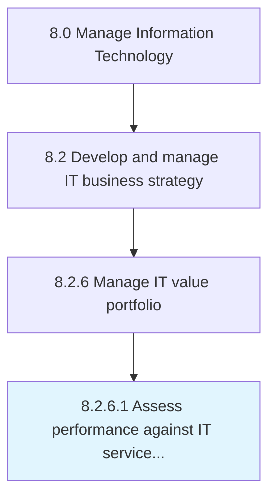

# Assess performance against IT service and project value criteria

> Process of evaluating performance to collect and analyze IT services and projects.

## Overview

Activity 8.2.6.1 is an activity within the Manage Information Technology framework. 

Process of evaluating performance to collect and analyze IT services and projects. Ensure expected IT service and project value based on established criteria.

## Process Hierarchy



## Key Statistics

| Metric | Value |
|--------|-------|
| APQC Code | 20694 |
| Hierarchy ID | 8.2.6.1 |
| Level | Activity |
| Parent | [8.2.6](../) |
| Sub-Processes | 0 |


## GraphDL Semantic Structure

```
assess.Performance.against.ITServiceAndProjectValueCriteria
```

| Component | Value | Description |
|-----------|-------|-------------|
| Verb | `assess` | Primary action |
| Object | `performance` | Direct object |
| Preposition | `against` | Relationship |
| PrepObject | `IT service and project value criteria` | Indirect object |


## Related Concepts

- Performance
- ITService
- ProjectValueCriteria


---

*Source: APQC PCF 20694 (8.2.6.1) - APQC*
