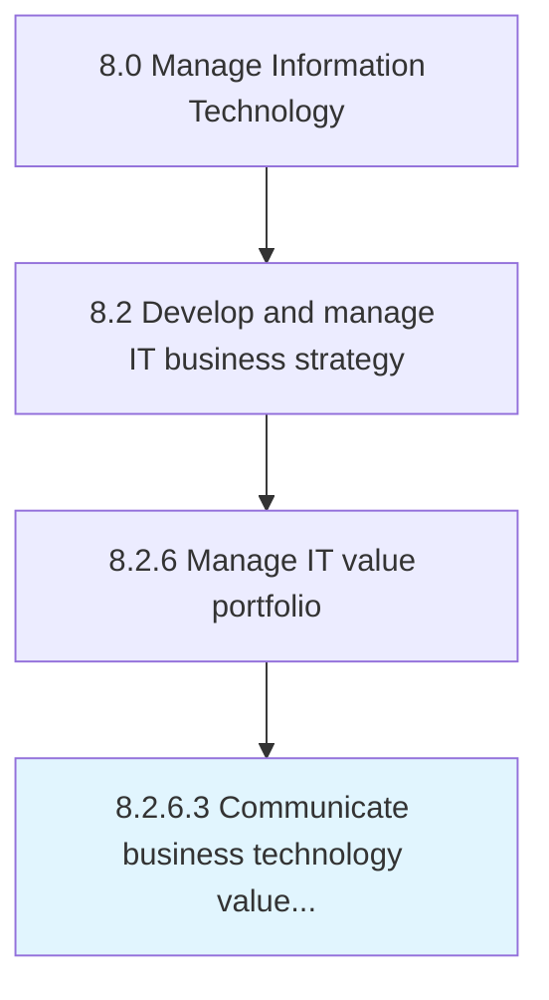

# Communicate business technology value contribution

> Conveying the value addition through adopting technology targeting towards integrated profitable business operations.

## Overview

Activity 8.2.6.3 is an activity within the Manage Information Technology framework. 

Conveying the value addition through adopting technology targeting towards integrated profitable business operations.

## Process Hierarchy



## Key Statistics

| Metric | Value |
|--------|-------|
| APQC Code | 20696 |
| Hierarchy ID | 8.2.6.3 |
| Level | Activity |
| Parent | [8.2.6](../) |
| Sub-Processes | 0 |


## GraphDL Semantic Structure

```
communicate.BusinessTechnologyValueContribution
```

| Component | Value | Description |
|-----------|-------|-------------|
| Verb | `communicate` | Primary action |
| Object | `business technology value contribution` | Direct object |


## Related Concepts

- [BusinessTechnologyValueContribution](/concepts/BusinessTechnologyValueContribution)


---

*Source: APQC PCF 20696 (8.2.6.3) - APQC*
