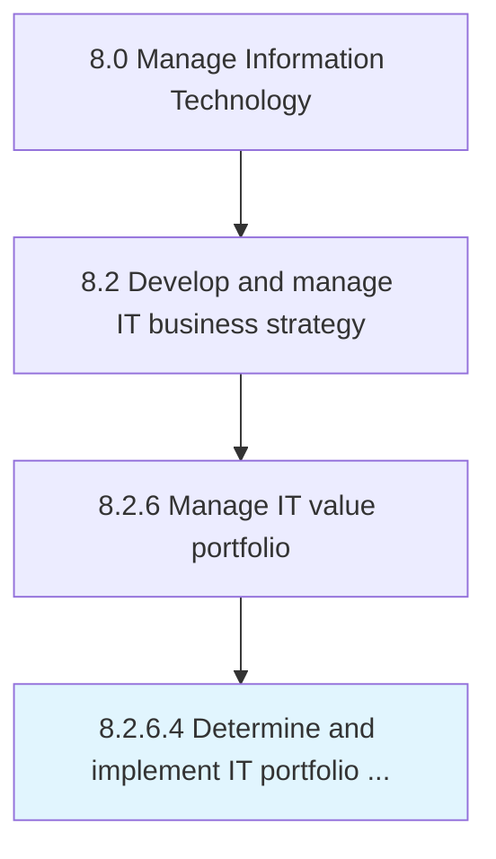

# Determine and implement IT portfolio adjustments

> Determining and implementing IT investments, projects, and activities based on trending technological advancements in the existing environment in order to achieve overall business objectives.

## Overview

Activity 8.2.6.4 is an activity within the Manage Information Technology framework. 

Determining and implementing IT investments, projects, and activities based on trending technological advancements in the existing environment in order to achieve overall business objectives.

## Process Hierarchy



## Key Statistics

| Metric | Value |
|--------|-------|
| APQC Code | 20697 |
| Hierarchy ID | 8.2.6.4 |
| Level | Activity |
| Parent | [8.2.6](../) |
| Sub-Processes | 0 |


## GraphDL Semantic Structure

```
determine.AndImplementITPortfolioAdjustments
```

| Component | Value | Description |
|-----------|-------|-------------|
| Verb | `determine` | Primary action |
| Object | `and implement IT portfolio adjustments` | Direct object |


## Related Concepts

- ITPortfolioAdjustments
- ITPortfolioAdjustments


---

*Source: APQC PCF 20697 (8.2.6.4) - APQC*
