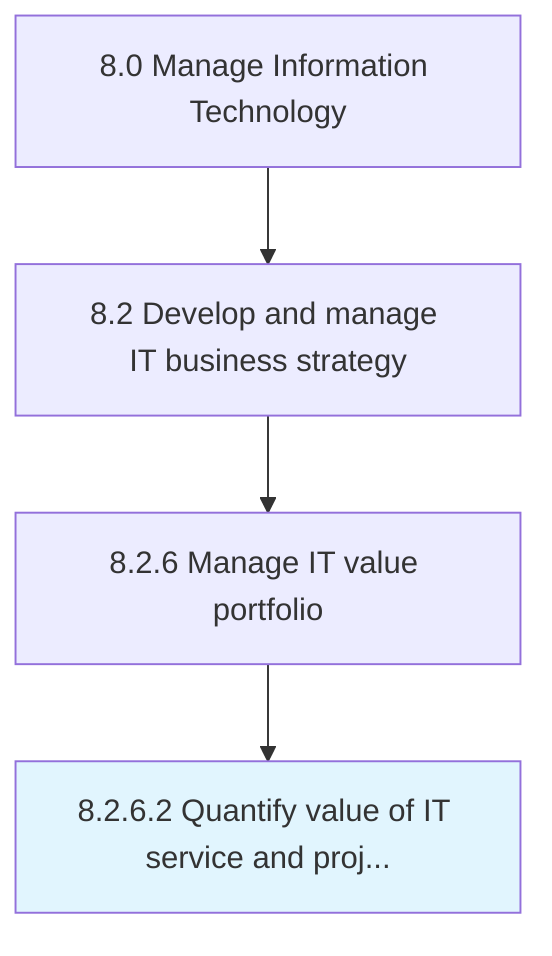

# Quantify value of IT service and project portfolio investments

> Evaluate the value of the investments, projects, and activities of IT function by assigning it a quantifiable value with a profitable return to business operations.

## Overview

Activity 8.2.6.2 is an activity within the Manage Information Technology framework. 

Evaluate the value of the investments, projects, and activities of IT function by assigning it a quantifiable value with a profitable return to business operations.

## Process Hierarchy



## Key Statistics

| Metric | Value |
|--------|-------|
| APQC Code | 20695 |
| Hierarchy ID | 8.2.6.2 |
| Level | Activity |
| Parent | [8.2.6](../) |
| Sub-Processes | 0 |


## GraphDL Semantic Structure

```
quantify.Value.of.ITServiceAndProjectPortfolioInvestments
```

| Component | Value | Description |
|-----------|-------|-------------|
| Verb | `quantify` | Primary action |
| Object | `value` | Direct object |
| Preposition | `of` | Relationship |
| PrepObject | `IT service and project portfolio investments` | Indirect object |


## Related Concepts

- Value
- ITService
- Value
- ProjectPortfolioInvestments


---

*Source: APQC PCF 20695 (8.2.6.2) - APQC*
