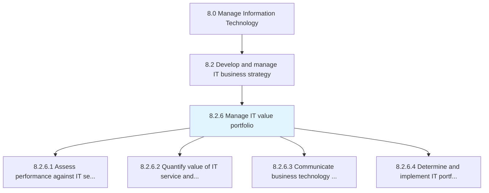
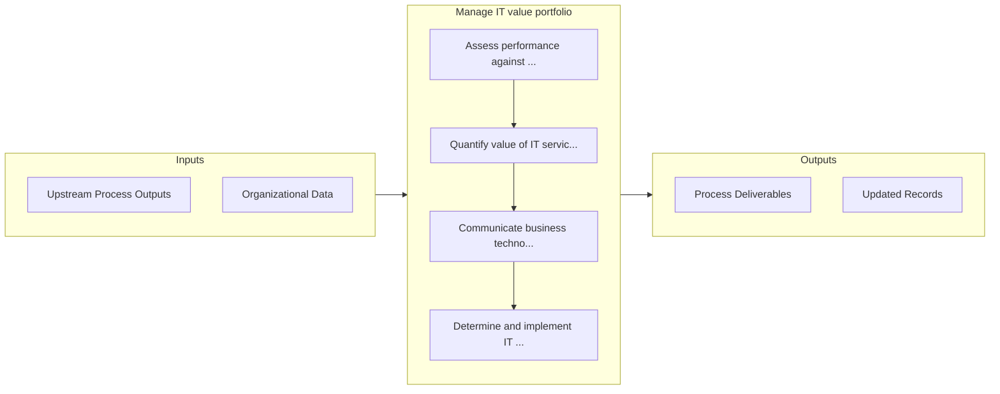

# Manage IT value portfolio

> Creating and establishing the value portfolio.

## Overview

Process 8.2.6 is a core process that defines the specific procedures for manage it value portfolio. 

Creating and establishing the value portfolio. Defining, analyzing, and examining the value of projects, investments, and activities of the IT function.

## Process Hierarchy



## Key Statistics

| Metric | Value |
|--------|-------|
| APQC Code | 20693 |
| Hierarchy ID | 8.2.6 |
| Level | Process |
| Parent | [8.2](../) |
| Sub-Processes | 4 |


## GraphDL Semantic Structure

```
manage.ITValuePortfolio
```

| Component | Value | Description |
|-----------|-------|-------------|
| Verb | `manage` | Primary action |
| Object | `IT value portfolio` | Direct object |


## Process Flow



## Sub-Processes

| Process | Hierarchy ID | Description |
|---------|-------------|-------------|
| [Assess performance against IT service and project value criteria](./AssessPerformanceAgainstITServiceAndProjectValueCriteria) | 8.2.6.1 | Process of evaluating performance to collect and analyze IT services and projects |
| [Quantify value of IT service and project portfolio investments](./QuantifyValueOfITServiceAndProjectPortfolioInvestments) | 8.2.6.2 | Evaluate the value of the investments, projects, and activities of IT function by assigning it a qua |
| [Communicate business technology value contribution](./CommunicateBusinessTechnologyValueContribution) | 8.2.6.3 | Conveying the value addition through adopting technology targeting towards integrated profitable bus |
| [Determine and implement IT portfolio adjustments](./DetermineAndImplementITPortfolioAdjustments) | 8.2.6.4 | Determining and implementing IT investments, projects, and activities based on trending technologica |


## Related Concepts

- [ITValuePortfolio](/concepts/ITValuePortfolio)


---

*Source: APQC PCF 20693 (8.2.6) - APQC*
