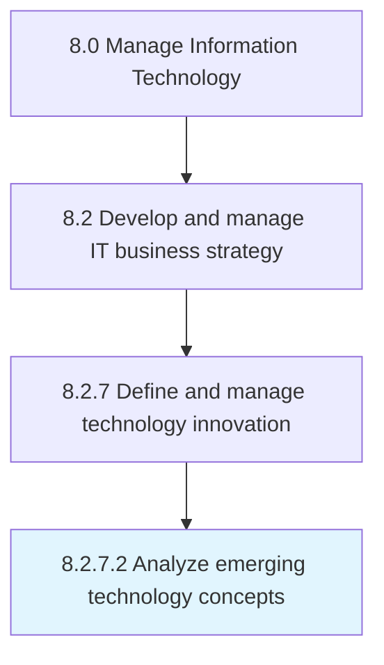

# Analyze emerging technology concepts

> Assessing new and future technologies relevant to the organization's vision of its IT capabilities.

## Overview

Activity 8.2.7.2 is an activity within the Manage Information Technology framework. 

Assessing new and future technologies relevant to the organization's vision of its IT capabilities.

## Process Hierarchy



## Key Statistics

| Metric | Value |
|--------|-------|
| APQC Code | 20701 |
| Hierarchy ID | 8.2.7.2 |
| Level | Activity |
| Parent | [8.2.7](../) |
| Sub-Processes | 0 |


## GraphDL Semantic Structure

```
analyze.EmergingTechnologyConcepts
```

| Component | Value | Description |
|-----------|-------|-------------|
| Verb | `analyze` | Primary action |
| Object | `emerging technology concepts` | Direct object |


## Related Concepts

- [EmergingTechnologyConcepts](/concepts/EmergingTechnologyConcepts)


---

*Source: APQC PCF 20701 (8.2.7.2) - APQC*
