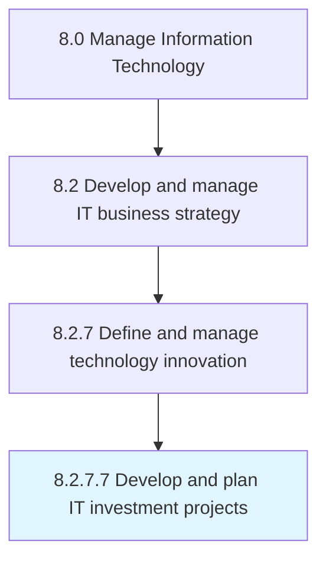

# Develop and plan IT investment projects

> Develop and plan long-term allocation of funds for information technology endeavors to meet business goals.

## Overview

Activity 8.2.7.7 is an activity within the Manage Information Technology framework. 

Develop and plan long-term allocation of funds for information technology endeavors to meet business goals.

## Process Hierarchy



## Key Statistics

| Metric | Value |
|--------|-------|
| APQC Code | 20705 |
| Hierarchy ID | 8.2.7.7 |
| Level | Activity |
| Parent | [8.2.7](../) |
| Sub-Processes | 0 |


## GraphDL Semantic Structure

```
develop.AndPlanITInvestmentProjects
```

| Component | Value | Description |
|-----------|-------|-------------|
| Verb | `develop` | Primary action |
| Object | `and plan IT investment projects` | Direct object |


## Related Concepts

- [ITInvestmentProjects](/concepts/ITInvestmentProjects)
- [ITInvestmentProjects](/concepts/ITInvestmentProjects)


---

*Source: APQC PCF 20705 (8.2.7.7) - APQC*
