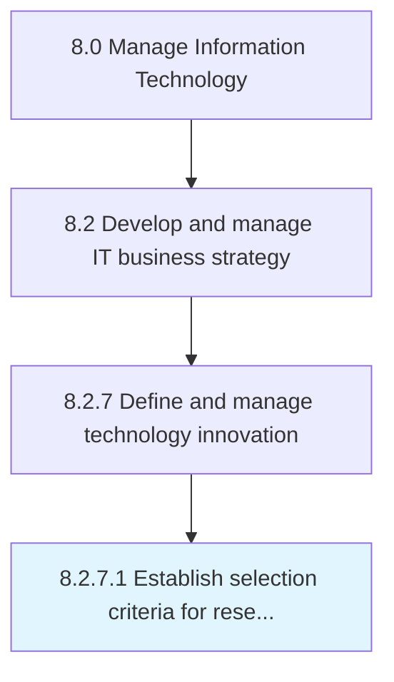

# Establish selection criteria for research initiatives

> Establishing the standard for selecting IT research initiatives to align with organizational criteria for implementing future technologies.

## Overview

Activity 8.2.7.1 is an activity within the Manage Information Technology framework. 

Establishing the standard for selecting IT research initiatives to align with organizational criteria for implementing future technologies.

## Process Hierarchy



## Key Statistics

| Metric | Value |
|--------|-------|
| APQC Code | 20700 |
| Hierarchy ID | 8.2.7.1 |
| Level | Activity |
| Parent | [8.2.7](../) |
| Sub-Processes | 0 |


## GraphDL Semantic Structure

```
establish.SelectionCriteria.for.ResearchInitiatives
```

| Component | Value | Description |
|-----------|-------|-------------|
| Verb | `establish` | Primary action |
| Object | `selection criteria` | Direct object |
| Preposition | `for` | Relationship |
| PrepObject | `research initiatives` | Indirect object |


## Related Concepts

- [SelectionCriteria](/concepts/SelectionCriteria)
- [ResearchInitiatives](/concepts/ResearchInitiatives)


---

*Source: APQC PCF 20700 (8.2.7.1) - APQC*
