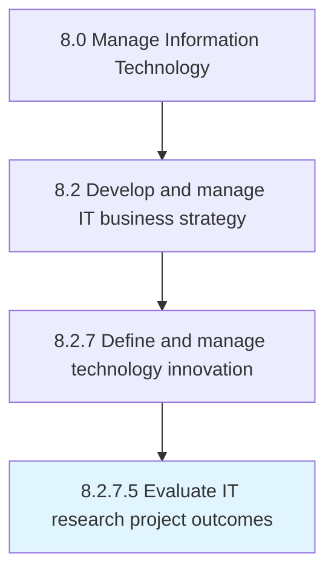

# Evaluate IT research project outcomes

> Assessing IT research projects based on defined outcome expectations.

## Overview

Activity 8.2.7.5 is an activity within the Manage Information Technology framework. 

Assessing IT research projects based on defined outcome expectations.

## Process Hierarchy



## Key Statistics

| Metric | Value |
|--------|-------|
| APQC Code | 20939 |
| Hierarchy ID | 8.2.7.5 |
| Level | Activity |
| Parent | [8.2.7](../) |
| Sub-Processes | 0 |


## GraphDL Semantic Structure

```
evaluate.ITResearchProjectOutcomes
```

| Component | Value | Description |
|-----------|-------|-------------|
| Verb | `evaluate` | Primary action |
| Object | `IT research project outcomes` | Direct object |


## Related Concepts

- ITResearchProjectOutcomes


---

*Source: APQC PCF 20939 (8.2.7.5) - APQC*
