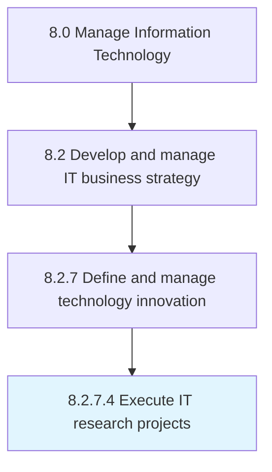

# Execute IT research projects

> Implement information technology research projects that focus on meeting the goals of the organization's IT services and capabilities.

## Overview

Activity 8.2.7.4 is an activity within the Manage Information Technology framework. 

Implement information technology research projects that focus on meeting the goals of the organization's IT services and capabilities.

## Process Hierarchy



## Key Statistics

| Metric | Value |
|--------|-------|
| APQC Code | 20703 |
| Hierarchy ID | 8.2.7.4 |
| Level | Activity |
| Parent | [8.2.7](../) |
| Sub-Processes | 0 |


## GraphDL Semantic Structure

```
execute.ITResearchProjects
```

| Component | Value | Description |
|-----------|-------|-------------|
| Verb | `execute` | Primary action |
| Object | `IT research projects` | Direct object |


## Related Concepts

- [ITResearchProjects](/concepts/ITResearchProjects)


---

*Source: APQC PCF 20703 (8.2.7.4) - APQC*
