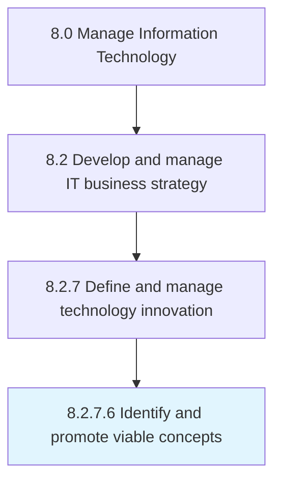

# Identify and promote viable concepts

> Determine project viability.

## Overview

Activity 8.2.7.6 is an activity within the Manage Information Technology framework. 

Determine project viability. Promote relevant IT innovations that meet business objectives.

## Process Hierarchy



## Key Statistics

| Metric | Value |
|--------|-------|
| APQC Code | 20704 |
| Hierarchy ID | 8.2.7.6 |
| Level | Activity |
| Parent | [8.2.7](../) |
| Sub-Processes | 0 |


## GraphDL Semantic Structure

```
identify.AndPromoteViableConcepts
```

| Component | Value | Description |
|-----------|-------|-------------|
| Verb | `identify` | Primary action |
| Object | `and promote viable concepts` | Direct object |


## Related Concepts

- ViableConcepts
- ViableConcepts


---

*Source: APQC PCF 20704 (8.2.7.6) - APQC*
