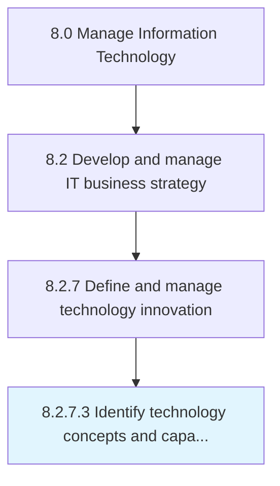

# Identify technology concepts and capabilities

> Identification of conceptual elements that define the benefits of technology to business.

## Overview

Activity 8.2.7.3 is an activity within the Manage Information Technology framework. 

Identification of conceptual elements that define the benefits of technology to business.

## Process Hierarchy



## Key Statistics

| Metric | Value |
|--------|-------|
| APQC Code | 20702 |
| Hierarchy ID | 8.2.7.3 |
| Level | Activity |
| Parent | [8.2.7](../) |
| Sub-Processes | 0 |


## GraphDL Semantic Structure

```
identify.TechnologyConceptsAndCapabilities
```

| Component | Value | Description |
|-----------|-------|-------------|
| Verb | `identify` | Primary action |
| Object | `technology concepts and capabilities` | Direct object |


## Related Concepts

- TechnologyConcepts
- Capabilities


---

*Source: APQC PCF 20702 (8.2.7.3) - APQC*
