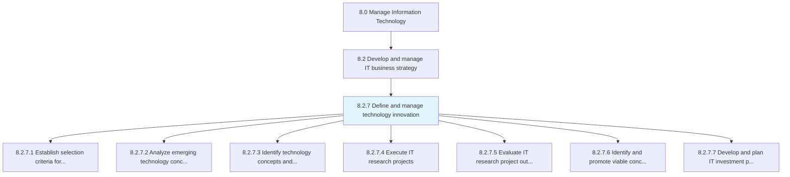
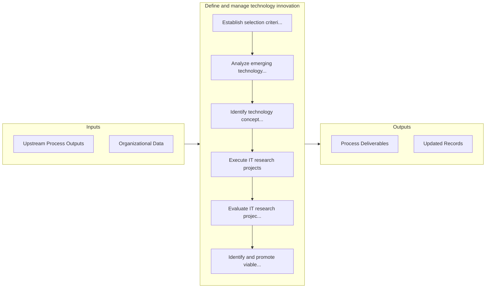

# Define and manage technology innovation

> Outline and manage the innovation of technology within the organization.

## Overview

Process 8.2.7 is a core process that defines the specific procedures for define and manage technology innovation. 

Outline and manage the innovation of technology within the organization. Research and understand emerging future technological concepts and capabilities. Plan for IT innovation investments. Plan and execute viable innovation projects.

## Process Hierarchy



## Key Statistics

| Metric | Value |
|--------|-------|
| APQC Code | 20699 |
| Hierarchy ID | 8.2.7 |
| Level | Process |
| Parent | [8.2](../) |
| Sub-Processes | 7 |


## GraphDL Semantic Structure

```graphdl
define.AndManageTechnologyInnovation
```

| Component | Value | Description |
|-----------|-------|-------------|
| Verb | `define` | Primary action |
| Object | `and manage technology innovation` | Direct object |


## Process Flow



## Sub-Processes

| Process | Hierarchy ID | Description |
|---------|-------------|-------------|
| [Establish selection criteria for research initiatives](./EstablishSelectionCriteriaForResearchInitiatives) | 8.2.7.1 | Establishing the standard for selecting IT research initiatives to align with organizational criteri |
| [Analyze emerging technology concepts](./AnalyzeEmergingTechnologyConcepts) | 8.2.7.2 | Assessing new and future technologies relevant to the organization's vision of its IT capabilities |
| [Identify technology concepts and capabilities](./IdentifyTechnologyConceptsAndCapabilities) | 8.2.7.3 | Identification of conceptual elements that define the benefits of technology to business |
| [Execute IT research projects](./ExecuteITResearchProjects) | 8.2.7.4 | Implement information technology research projects that focus on meeting the goals of the organizati |
| [Evaluate IT research project outcomes](./EvaluateITResearchProjectOutcomes) | 8.2.7.5 | Assessing IT research projects based on defined outcome expectations |
| [Identify and promote viable concepts](./IdentifyAndPromoteViableConcepts) | 8.2.7.6 | Determine project viability |
| [Develop and plan IT investment projects](./DevelopAndPlanITInvestmentProjects) | 8.2.7.7 | Develop and plan long-term allocation of funds for information technology endeavors to meet business |


## Related Concepts

- TechnologyInnovation
- TechnologyInnovation


---

*Source: APQC PCF 20699 (8.2.7) - APQC*
