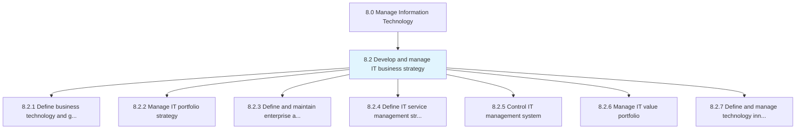
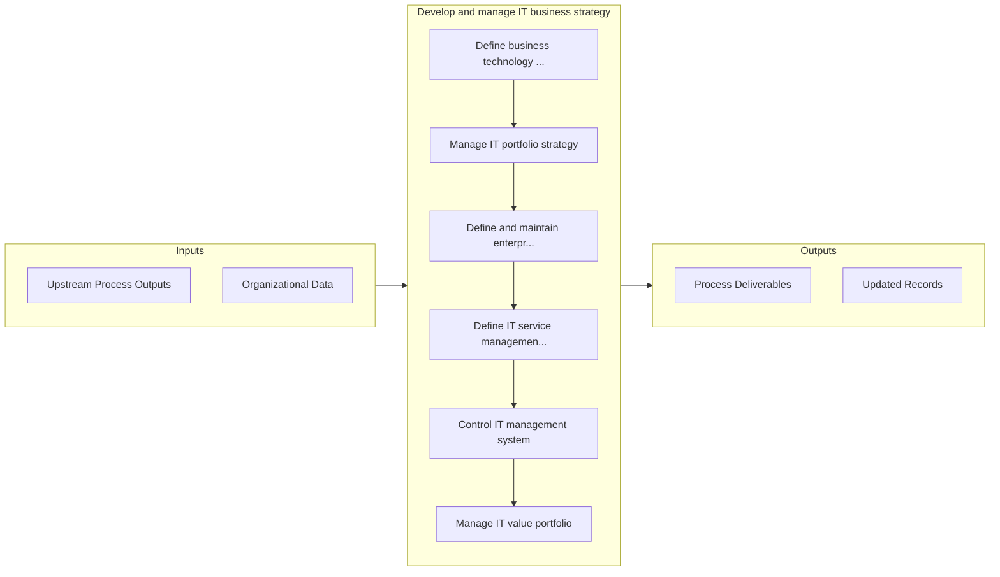

# Develop and manage IT business strategy

> Handling the business of IT.

## Overview

Group 8.2 is a process group within APQC Category 8.0 (Manage Information Technology). 

Handling the business of IT. Create a organization-wide strategy for the IT function. Define the organization's IT architecture. Manage the IT portfolio. Research and innovate in the field of IT. Assess and convey the performance and the value of the IT function.

## Process Hierarchy



## Key Statistics

| Metric | Value |
|--------|-------|
| APQC Code | 20652 |
| Hierarchy ID | 8.2 |
| Level | Group |
| Parent | [8](../) |
| Sub-Processes | 7 |


## GraphDL Semantic Structure

```
develop.AndManageITBusinessStrategy
```

| Component | Value | Description |
|-----------|-------|-------------|
| Verb | `develop` | Primary action |
| Object | `and manage IT business strategy` | Direct object |


## Process Flow



## Sub-Processes

| Process | Hierarchy ID | Description |
|---------|-------------|-------------|
| [Define business technology and governance strategy](./8.2.1-DefineBusinessTechnologyGovernance/) | 8.2.1 | Defining the need of technology in business and systematic implementation of IT investments |
| [Manage IT portfolio strategy](./8.2.2-ManageITPortfolioStrategy/) | 8.2.2 | Strategy for systematic management of IT investments, projects, and activities |
| [Define and maintain enterprise architecture](./8.2.3-DefineMaintainEnterpriseArchitecture/) | 8.2.3 | Outlining and maintaining the organization's IT architecture |
| [Define IT service management strategy](./8.2.4-DefineITServiceManagement/) | 8.2.4 | Defining perspective, position, plans, and patterns needed to execute designing, delivering, managin |
| [Control IT management system](./8.2.5-ControlITManagementSystem/) | 8.2.5 | Regulating the IT management system through performance measures, governance, analysis, and monitori |
| [Manage IT value portfolio](./8.2.6-ManageITValuePortfolio/) | 8.2.6 | Creating and establishing the value portfolio |
| [Define and manage technology innovation](./8.2.7-DefineManageTechnologyInnovation/) | 8.2.7 | Outline and manage the innovation of technology within the organization |


## Related Concepts

- [ITBusinessStrategy](/concepts/ITBusinessStrategy)
- [ITBusinessStrategy](/concepts/ITBusinessStrategy)


---

*Source: APQC PCF 20652 (8.2) - APQC*
