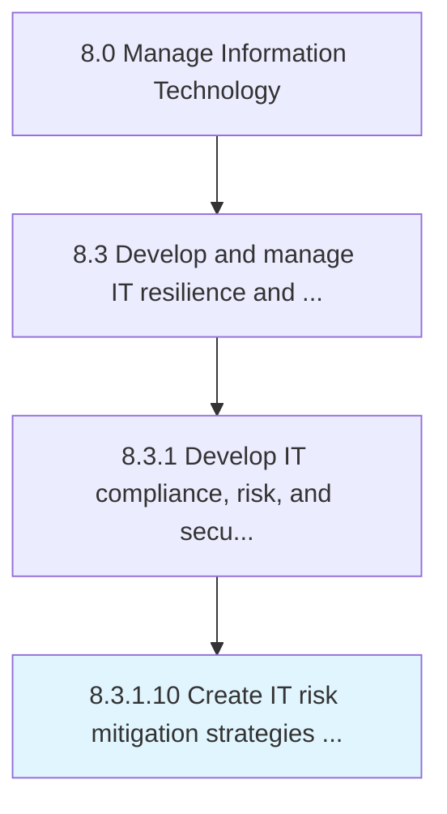

# Create IT risk mitigation strategies and approaches

> Developing activities to improve performance opportunities and lessen threats in IT.

## Overview

Activity 8.3.1.10 is an activity within the Manage Information Technology framework. 

Developing activities to improve performance opportunities and lessen threats in IT. Evolve strategies and policies to attain organizational objectives.

## Process Hierarchy



## Key Statistics

| Metric | Value |
|--------|-------|
| APQC Code | 20715 |
| Hierarchy ID | 8.3.1.10 |
| Level | Activity |
| Parent | [8.3.1](../) |
| Sub-Processes | 0 |


## GraphDL Semantic Structure

```
create.ITRiskMitigationStrategiesAndApproaches
```

| Component | Value | Description |
|-----------|-------|-------------|
| Verb | `create` | Primary action |
| Object | `IT risk mitigation strategies and approaches` | Direct object |


## Related Concepts

- [ITRiskMitigationStrategies](/concepts/ITRiskMitigationStrategies)
- [Approaches](/concepts/Approaches)


---

*Source: APQC PCF 20715 (8.3.1.10) - APQC*
