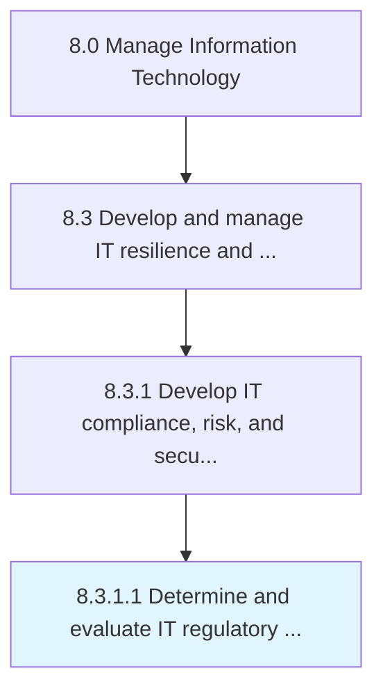

# Determine and evaluate IT regulatory and audit requirements

> Determining and evaluating IT regulatory and audit requirements.

## Overview

Activity 8.3.1.1 is an activity within the Manage Information Technology framework. 

Determining and evaluating IT regulatory and audit requirements. Train employees on regulatory and audit requirements. Records for the appropriate regulatory and audit agencies must be maintained and the new product process must be approved by the appropriate regulatory body before it is published to the organization.

## Process Hierarchy



## Key Statistics

| Metric | Value |
|--------|-------|
| APQC Code | 20708 |
| Hierarchy ID | 8.3.1.1 |
| Level | Activity |
| Parent | [8.3.1](../) |
| Sub-Processes | 0 |


## GraphDL Semantic Structure

```
determine.AndEvaluateITRegulatoryAndAuditRequirements
```

| Component | Value | Description |
|-----------|-------|-------------|
| Verb | `determine` | Primary action |
| Object | `and evaluate IT regulatory and audit requirements` | Direct object |


## Related Concepts

- [ITRegulatory](/concepts/ITRegulatory)
- [AuditRequirements](/concepts/AuditRequirements)
- [ITRegulatory](/concepts/ITRegulatory)
- [AuditRequirements](/concepts/AuditRequirements)


---

*Source: APQC PCF 20708 (8.3.1.1) - APQC*
