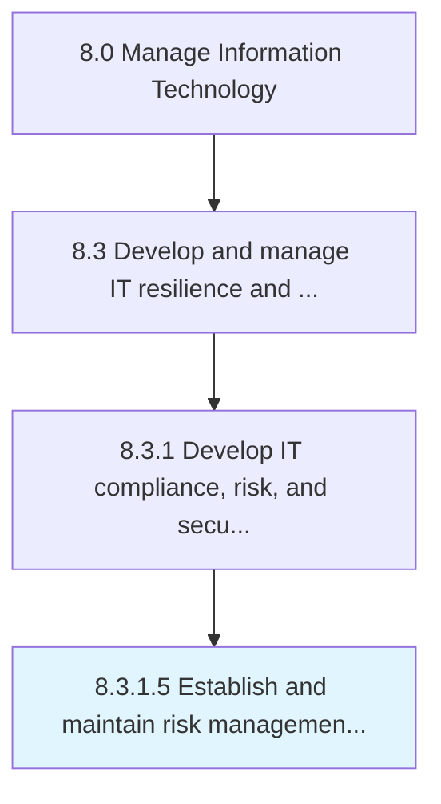

# Establish and maintain risk management roles

> Determine and maintain roles that are specialized in each risk areas and coordinating all risk management activities for IT function with due escalation structure.

## Overview

Activity 8.3.1.5 is an activity within the Manage Information Technology framework. 

Determine and maintain roles that are specialized in each risk areas and coordinating all risk management activities for IT function with due escalation structure.

## Process Hierarchy



## Key Statistics

| Metric | Value |
|--------|-------|
| APQC Code | 20711 |
| Hierarchy ID | 8.3.1.5 |
| Level | Activity |
| Parent | [8.3.1](../) |
| Sub-Processes | 0 |


## GraphDL Semantic Structure

```
establish.AndMaintainRiskManagementRoles
```

| Component | Value | Description |
|-----------|-------|-------------|
| Verb | `establish` | Primary action |
| Object | `and maintain risk management roles` | Direct object |


## Related Concepts

- [RiskManagementRoles](/concepts/RiskManagementRoles)
- [RiskManagementRoles](/concepts/RiskManagementRoles)


---

*Source: APQC PCF 20711 (8.3.1.5) - APQC*
