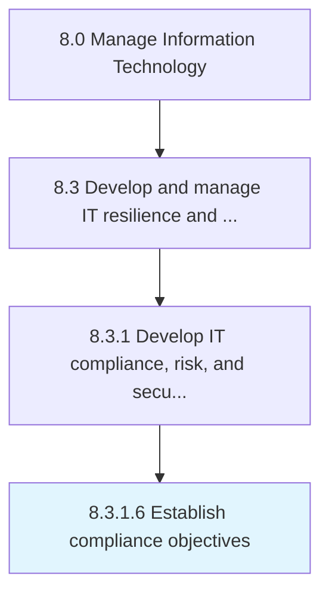

# Establish compliance objectives

> Establishing compliance objectives which ensures that the organization has systems of internal controls that adequately measure and manage IT risk.

## Overview

Activity 8.3.1.6 is an activity within the Manage Information Technology framework. 

Establishing compliance objectives which ensures that the organization has systems of internal controls that adequately measure and manage IT risk.

## Process Hierarchy



## Key Statistics

| Metric | Value |
|--------|-------|
| APQC Code | 20712 |
| Hierarchy ID | 8.3.1.6 |
| Level | Activity |
| Parent | [8.3.1](../) |
| Sub-Processes | 0 |


## GraphDL Semantic Structure

```
establish.ComplianceObjectives
```

| Component | Value | Description |
|-----------|-------|-------------|
| Verb | `establish` | Primary action |
| Object | `compliance objectives` | Direct object |


## Related Concepts

- [ComplianceObjectives](/concepts/ComplianceObjectives)


---

*Source: APQC PCF 20712 (8.3.1.6) - APQC*
