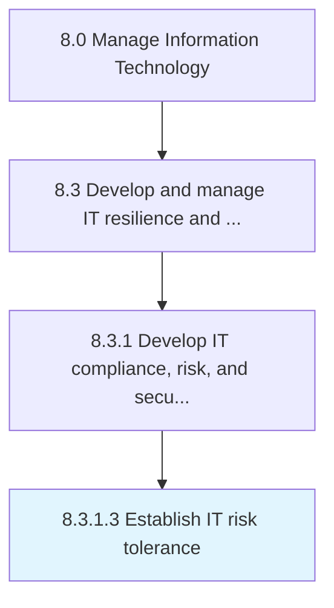

# Establish IT risk tolerance

> Determine the specific maximum risk to take in quantitative terms for each relevant risk sub-category, including strategic, operational, financial, and compliance risks.

## Overview

Activity 8.3.1.3 is an activity within the Manage Information Technology framework. 

Determine the specific maximum risk to take in quantitative terms for each relevant risk sub-category, including strategic, operational, financial, and compliance risks.

## Process Hierarchy



## Key Statistics

| Metric | Value |
|--------|-------|
| APQC Code | 20709 |
| Hierarchy ID | 8.3.1.3 |
| Level | Activity |
| Parent | [8.3.1](../) |
| Sub-Processes | 0 |


## GraphDL Semantic Structure

```
establish.ITRiskTolerance
```

| Component | Value | Description |
|-----------|-------|-------------|
| Verb | `establish` | Primary action |
| Object | `IT risk tolerance` | Direct object |


## Related Concepts

- ITRiskTolerance


---

*Source: APQC PCF 20709 (8.3.1.3) - APQC*
