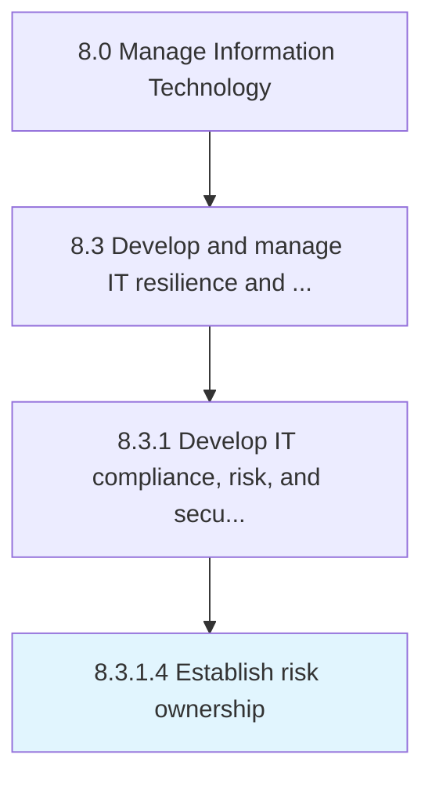

# Establish risk ownership

> Establish an individual or a group who is ultimately accountable for ensuring that IT risks are managed appropriately.

## Overview

Activity 8.3.1.4 is an activity within the Manage Information Technology framework. 

Establish an individual or a group who is ultimately accountable for ensuring that IT risks are managed appropriately.

## Process Hierarchy



## Key Statistics

| Metric | Value |
|--------|-------|
| APQC Code | 20710 |
| Hierarchy ID | 8.3.1.4 |
| Level | Activity |
| Parent | [8.3.1](../) |
| Sub-Processes | 0 |


## GraphDL Semantic Structure

```
establish.RiskOwnership
```

| Component | Value | Description |
|-----------|-------|-------------|
| Verb | `establish` | Primary action |
| Object | `risk ownership` | Direct object |


## Related Concepts

- RiskOwnership


---

*Source: APQC PCF 20710 (8.3.1.4) - APQC*
