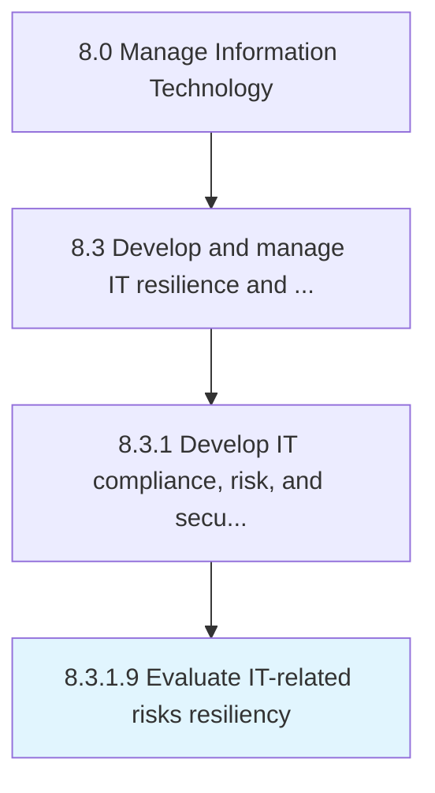

# Evaluate IT-related risks resiliency

> Assess IT-related risk resilience strategies to ensure that the organization effectively manages its risk.

## Overview

Activity 8.3.1.9 is an activity within the Manage Information Technology framework. 

Assess IT-related risk resilience strategies to ensure that the organization effectively manages its risk.

## Process Hierarchy



## Key Statistics

| Metric | Value |
|--------|-------|
| APQC Code | 20714 |
| Hierarchy ID | 8.3.1.9 |
| Level | Activity |
| Parent | [8.3.1](../) |
| Sub-Processes | 0 |


## GraphDL Semantic Structure

```
evaluate.ITrelatedRisksResiliency
```

| Component | Value | Description |
|-----------|-------|-------------|
| Verb | `evaluate` | Primary action |
| Object | `IT-related risks resiliency` | Direct object |


---

*Source: APQC PCF 20714 (8.3.1.9) - APQC*
