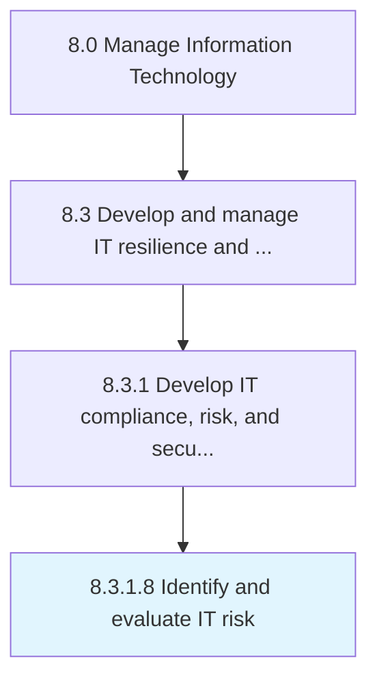

# Identify and evaluate IT risk

> Developing a timely and continuous process to identify and evaluate activities that might hinder IT operations or an IT project's goals.

## Overview

Activity 8.3.1.8 is an activity within the Manage Information Technology framework. 

Developing a timely and continuous process to identify and evaluate activities that might hinder IT operations or an IT project's goals.

## Process Hierarchy



## Key Statistics

| Metric | Value |
|--------|-------|
| APQC Code | 20713 |
| Hierarchy ID | 8.3.1.8 |
| Level | Activity |
| Parent | [8.3.1](../) |
| Sub-Processes | 0 |


## GraphDL Semantic Structure

```
identify.AndEvaluateITRisk
```

| Component | Value | Description |
|-----------|-------|-------------|
| Verb | `identify` | Primary action |
| Object | `and evaluate IT risk` | Direct object |


## Related Concepts

- [ITRisk](/concepts/ITRisk)
- [ITRisk](/concepts/ITRisk)


---

*Source: APQC PCF 20713 (8.3.1.8) - APQC*
