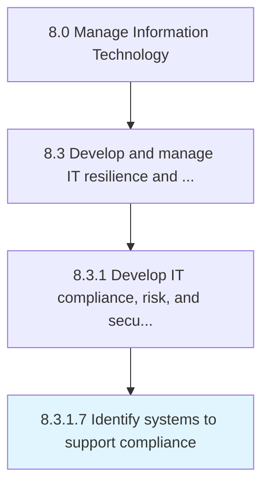

# Identify systems to support compliance

> Identifying and adopting information technology solutions to support changing regulatory compliance.

## Overview

Activity 8.3.1.7 is an activity within the Manage Information Technology framework. 

Identifying and adopting information technology solutions to support changing regulatory compliance. Safeguard compliance and manage risk by outlining the risk policies and procedures.

## Process Hierarchy



## Key Statistics

| Metric | Value |
|--------|-------|
| APQC Code | 20941 |
| Hierarchy ID | 8.3.1.7 |
| Level | Activity |
| Parent | [8.3.1](../) |
| Sub-Processes | 0 |


## GraphDL Semantic Structure

```
identify.Systems.to.SupportCompliance
```

| Component | Value | Description |
|-----------|-------|-------------|
| Verb | `identify` | Primary action |
| Object | `systems` | Direct object |
| Preposition | `to` | Relationship |
| PrepObject | `support compliance` | Indirect object |


## Related Concepts

- Systems
- SupportCompliance


---

*Source: APQC PCF 20941 (8.3.1.7) - APQC*
