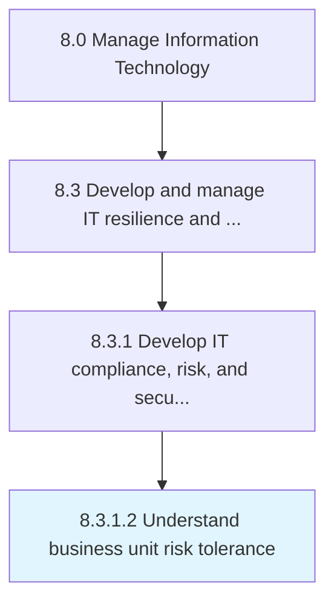

# Understand business unit risk tolerance

> Understand the risk tolerance levels of individual business units, given risk-return trade-offs for one or more anticipated and predictable consequences.

## Overview

Activity 8.3.1.2 is an activity within the Manage Information Technology framework. 

Understand the risk tolerance levels of individual business units, given risk-return trade-offs for one or more anticipated and predictable consequences.

## Process Hierarchy



## Key Statistics

| Metric | Value |
|--------|-------|
| APQC Code | 20940 |
| Hierarchy ID | 8.3.1.2 |
| Level | Activity |
| Parent | [8.3.1](../) |
| Sub-Processes | 0 |


## GraphDL Semantic Structure

```
understand.BusinessUnitRiskTolerance
```

| Component | Value | Description |
|-----------|-------|-------------|
| Verb | `understand` | Primary action |
| Object | `business unit risk tolerance` | Direct object |


## Related Concepts

- [BusinessUnitRiskTolerance](/concepts/BusinessUnitRiskTolerance)


---

*Source: APQC PCF 20940 (8.3.1.2) - APQC*
