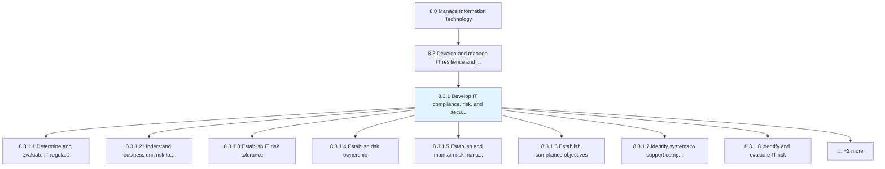
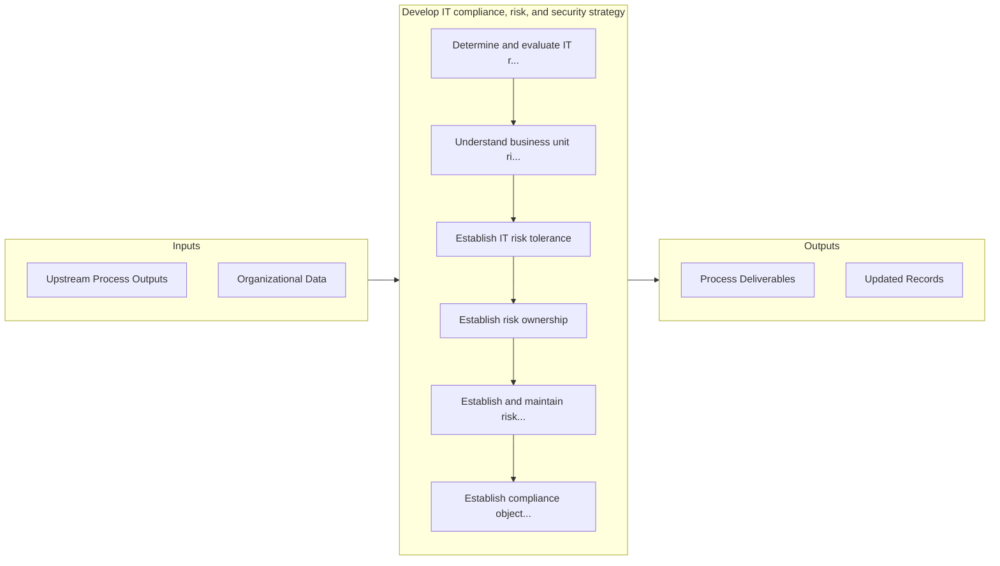

# Develop IT compliance, risk, and security strategy

> Ensuring that the organization effectively manages risk.

## Overview

Process 8.3.1 is a core process that defines the specific procedures for develop it compliance, risk, and security strategy. 

Ensuring that the organization effectively manages risk. Develop rules and standards for robust IT operations, manage risk, and adopt measures to protect integrity, confidentiality, and security of IT assets.

## Process Hierarchy



## Key Statistics

| Metric | Value |
|--------|-------|
| APQC Code | 20707 |
| Hierarchy ID | 8.3.1 |
| Level | Process |
| Parent | [8.3](../) |
| Sub-Processes | 10 |


## GraphDL Semantic Structure

```
develop.ITComplianceRiskAndSecurityStrategy
```

| Component | Value | Description |
|-----------|-------|-------------|
| Verb | `develop` | Primary action |
| Object | `IT compliance, risk, and security strategy` | Direct object |


## Process Flow



## Sub-Processes

| Process | Hierarchy ID | Description |
|---------|-------------|-------------|
| [Determine and evaluate IT regulatory and audit requirements](./DetermineAndEvaluateITRegulatoryAndAuditRequirements) | 8.3.1.1 | Determining and evaluating IT regulatory and audit requirements |
| [Understand business unit risk tolerance](./UnderstandBusinessUnitRiskTolerance) | 8.3.1.2 | Understand the risk tolerance levels of individual business units, given risk-return trade-offs for  |
| [Establish IT risk tolerance](./EstablishITRiskTolerance) | 8.3.1.3 | Determine the specific maximum risk to take in quantitative terms for each relevant risk sub-categor |
| [Establish risk ownership](./EstablishRiskOwnership) | 8.3.1.4 | Establish an individual or a group who is ultimately accountable for ensuring that IT risks are mana |
| [Establish and maintain risk management roles](./EstablishAndMaintainRiskManagementRoles) | 8.3.1.5 | Determine and maintain roles that are specialized in each risk areas and coordinating all risk manag |
| [Establish compliance objectives](./EstablishComplianceObjectives) | 8.3.1.6 | Establishing compliance objectives which ensures that the organization has systems of internal contr |
| [Identify systems to support compliance](./IdentifySystemsToSupportCompliance) | 8.3.1.7 | Identifying and adopting information technology solutions to support changing regulatory compliance |
| [Identify and evaluate IT risk](./IdentifyAndEvaluateITRisk) | 8.3.1.8 | Developing a timely and continuous process to identify and evaluate activities that might hinder IT  |
| [Evaluate IT-related risks resiliency](./EvaluateITrelatedRisksResiliency) | 8.3.1.9 | Assess IT-related risk resilience strategies to ensure that the organization effectively manages its |
| [Create IT risk mitigation strategies and approaches](./CreateITRiskMitigationStrategiesAndApproaches) | 8.3.1.10 | Developing activities to improve performance opportunities and lessen threats in IT |


## Related Concepts

- ITCompliance
- Risk
- SecurityStrategy


---

*Source: APQC PCF 20707 (8.3.1) - APQC*
