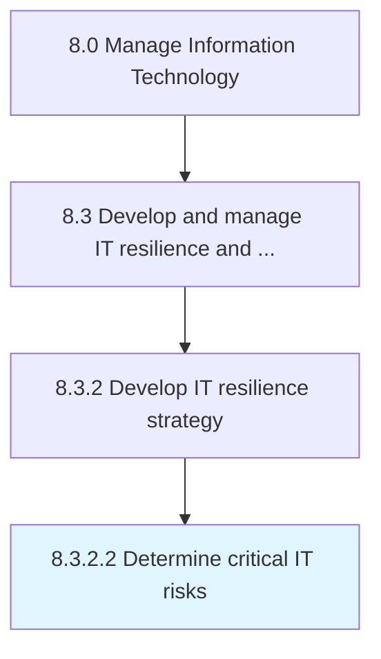

# Determine critical IT risks

> Determining risks that could disrupt objectives of IT.

## Overview

Activity 8.3.2.2 is an activity within the Manage Information Technology framework. 

Determining risks that could disrupt objectives of IT.

## Process Hierarchy



## Key Statistics

| Metric | Value |
|--------|-------|
| APQC Code | 20718 |
| Hierarchy ID | 8.3.2.2 |
| Level | Activity |
| Parent | [8.3.2](../) |
| Sub-Processes | 0 |


## GraphDL Semantic Structure

```
determine.CriticalITRisks
```

| Component | Value | Description |
|-----------|-------|-------------|
| Verb | `determine` | Primary action |
| Object | `critical IT risks` | Direct object |


## Related Concepts

- [CriticalITRisks](/concepts/CriticalITRisks)


---

*Source: APQC PCF 20718 (8.3.2.2) - APQC*
