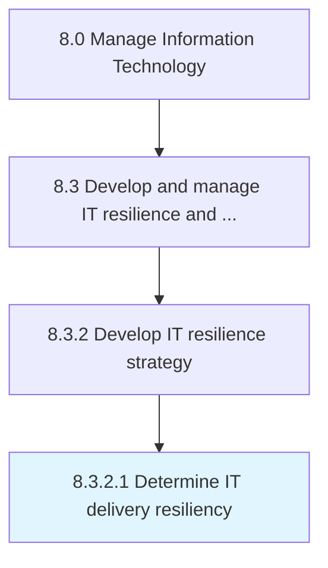

# Determine IT delivery resiliency

> Determining resilience strategies to ensure that IT effectively manages it's delivery process to mitigate risk.

## Overview

Activity 8.3.2.1 is an activity within the Manage Information Technology framework. 

Determining resilience strategies to ensure that IT effectively manages it's delivery process to mitigate risk.

## Process Hierarchy



## Key Statistics

| Metric | Value |
|--------|-------|
| APQC Code | 20717 |
| Hierarchy ID | 8.3.2.1 |
| Level | Activity |
| Parent | [8.3.2](../) |
| Sub-Processes | 0 |


## GraphDL Semantic Structure

```
determine.ITDeliveryResiliency
```

| Component | Value | Description |
|-----------|-------|-------------|
| Verb | `determine` | Primary action |
| Object | `IT delivery resiliency` | Direct object |


## Related Concepts

- ITDeliveryResiliency


---

*Source: APQC PCF 20717 (8.3.2.1) - APQC*
