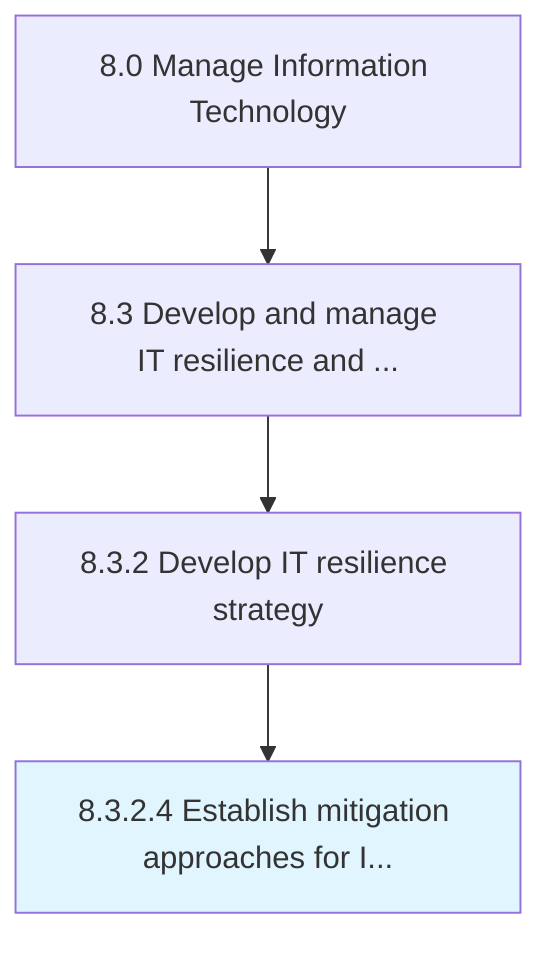

# Establish mitigation approaches for IT risks

> Establishing activities to improve opportunities and lessen threats for IT.

## Overview

Activity 8.3.2.4 is an activity within the Manage Information Technology framework. 

Establishing activities to improve opportunities and lessen threats for IT.

## Process Hierarchy



## Key Statistics

| Metric | Value |
|--------|-------|
| APQC Code | 20720 |
| Hierarchy ID | 8.3.2.4 |
| Level | Activity |
| Parent | [8.3.2](../) |
| Sub-Processes | 0 |


## GraphDL Semantic Structure

```
establish.MitigationApproaches.for.ITRisks
```

| Component | Value | Description |
|-----------|-------|-------------|
| Verb | `establish` | Primary action |
| Object | `mitigation approaches` | Direct object |
| Preposition | `for` | Relationship |
| PrepObject | `IT risks` | Indirect object |


## Related Concepts

- [MitigationApproaches](/concepts/MitigationApproaches)
- [ITRisks](/concepts/ITRisks)


---

*Source: APQC PCF 20720 (8.3.2.4) - APQC*
