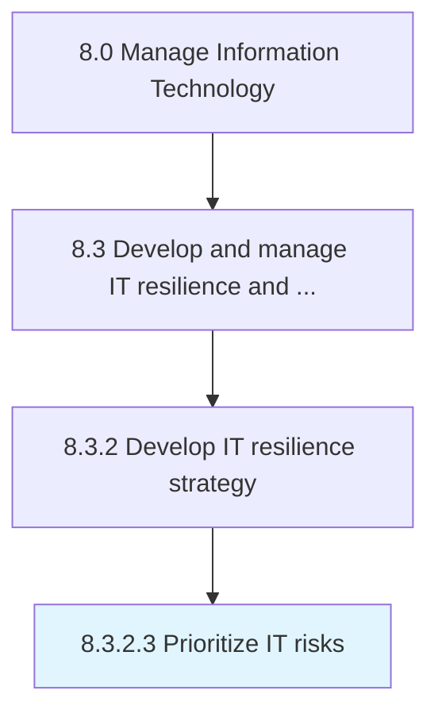

# Prioritize IT risks

> Prioritize potential IT risks based on business need to ensure overall IT stability.

## Overview

Activity 8.3.2.3 is an activity within the Manage Information Technology framework. 

Prioritize potential IT risks based on business need to ensure overall IT stability.

## Process Hierarchy



## Key Statistics

| Metric | Value |
|--------|-------|
| APQC Code | 20719 |
| Hierarchy ID | 8.3.2.3 |
| Level | Activity |
| Parent | [8.3.2](../) |
| Sub-Processes | 0 |


## GraphDL Semantic Structure

```
prioritize.ITRisks
```

| Component | Value | Description |
|-----------|-------|-------------|
| Verb | `prioritize` | Primary action |
| Object | `IT risks` | Direct object |


## Related Concepts

- ITRisks


---

*Source: APQC PCF 20719 (8.3.2.3) - APQC*
