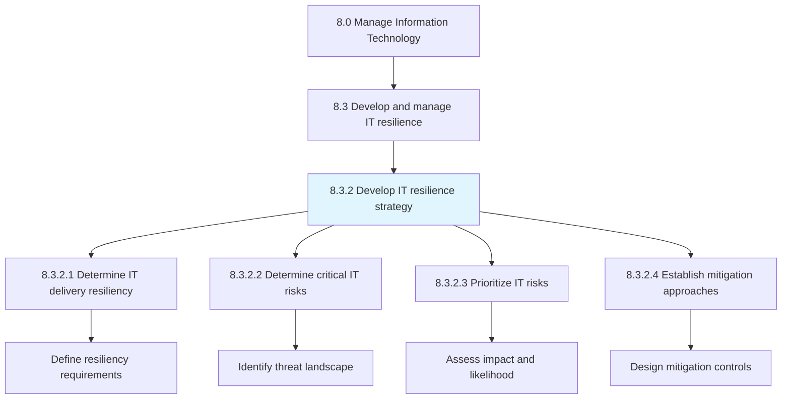
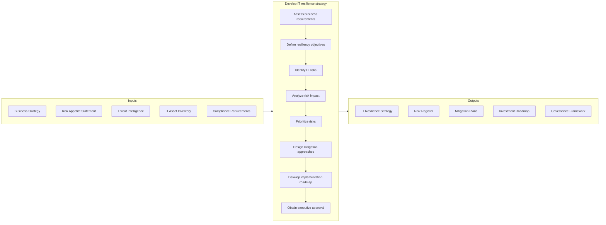
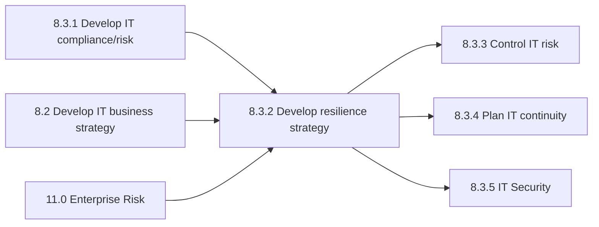

# Develop IT resilience strategy

> Developing resilience strategies of IT across the organization so that prospective risks can be avoided.

## Overview

Process 8.3.2 is a core process that defines the specific procedures for developing IT resilience strategy. This process establishes the strategic framework for ensuring IT systems can withstand, adapt to, and recover from disruptions.

Developing resilience strategies of IT across the organization so that prospective risks can be avoided. This includes identifying critical IT risks, prioritizing risk responses, and establishing mitigation approaches that align with business objectives and risk tolerance.

IT resilience strategy goes beyond traditional disaster recovery to encompass proactive risk identification, redundancy design, graceful degradation capabilities, and continuous adaptation to emerging threats. A comprehensive resilience strategy ensures that IT can continue to support business operations even under adverse conditions.

## Process Hierarchy



## Key Statistics

| Metric | Value |
|--------|-------|
| APQC Code | 20716 |
| Hierarchy ID | 8.3.2 |
| Level | Process |
| Parent | [8.3](../) |
| Sub-Processes | 4 |
| Industry Variants | 19 |

## GraphDL Semantic Structure

```graphdl
develop.ITResilienceStrategy
determine.ITDeliveryResiliency
establish.RiskMitigation
```

| Component | Value | Description |
|-----------|-------|-------------|
| Verb | `develop` | Primary action of creating strategy |
| Object | `IT resilience strategy` | Strategic framework for IT resilience |

## Process Flow



## Child Process Listings

### 8.3.2.1 - Determine IT delivery resiliency

Determining resilience strategies to ensure that IT effectively manages its delivery process to mitigate risks and maintain service levels. This sub-process establishes resiliency requirements.

**Key Activities:**
- Define service level resiliency targets
- Assess current resiliency capabilities
- Identify critical service dependencies
- Establish resiliency architecture principles
- Design failover and redundancy requirements

[View Process Details](./DetermineITDeliveryResiliency)

### 8.3.2.2 - Determine critical IT risks

Determining risks that could disrupt objectives of IT. This sub-process systematically identifies and catalogs risks across the IT landscape.

**Key Activities:**
- Conduct threat landscape analysis
- Identify internal and external risks
- Assess vulnerability exposure
- Document risk scenarios
- Maintain risk inventory

[View Process Details](./DetermineCriticalITRisks)

### 8.3.2.3 - Prioritize IT risks

Prioritize potential IT risks based on business need to ensure overall IT stability. This sub-process enables resource allocation to highest-priority risks.

**Key Activities:**
- Assess risk likelihood and impact
- Apply risk scoring methodology
- Align with business priorities
- Create risk heat map
- Document prioritization rationale

[View Process Details](./PrioritizeITRisks)

### 8.3.2.4 - Establish mitigation approaches for IT risks

Establishing activities to improve opportunities and lessen threats for IT. This sub-process defines specific risk treatment strategies.

**Key Activities:**
- Design risk mitigation controls
- Evaluate risk transfer options
- Define risk acceptance criteria
- Develop implementation plans
- Establish monitoring mechanisms

[View Process Details](./EstablishMitigationApproachesForITRisks)

## RACI Matrix

| Activity | IT Risk Manager | CIO | Enterprise Risk Manager | Security Manager | Architecture Lead | Business Unit Heads |
|----------|----------------|-----|------------------------|------------------|-------------------|---------------------|
| Assess business requirements | C | I | C | I | C | A |
| Define resiliency objectives | R | A | C | C | C | C |
| Identify IT risks | R | I | C | R | C | I |
| Analyze risk impact | R | I | A | C | C | C |
| Prioritize risks | R | A | C | C | I | C |
| Design mitigation approaches | R | A | C | R | R | I |
| Develop implementation roadmap | R | A | C | C | C | C |
| Obtain executive approval | C | R | C | I | I | A |

**Legend:** R = Responsible, A = Accountable, C = Consulted, I = Informed

## Metrics and KPIs

| Metric | Description | Target | Frequency |
|--------|-------------|--------|-----------|
| Risk Coverage | Percentage of IT assets with risk assessment | 100% | Quarterly |
| Mitigation Implementation Rate | Percentage of planned mitigations implemented | >85% | Quarterly |
| Risk Reduction | Percentage reduction in risk exposure | >20% | Annual |
| Strategy Currency | Time since last strategy update | <12 months | Annual |
| Stakeholder Alignment | Business acceptance of resilience strategy | >90% | Annual |
| Investment Efficiency | Risk reduction per dollar invested | Benchmark | Annual |
| Emerging Risk Identification | Time to identify new risks | <30 days | Per occurrence |
| Control Effectiveness | Percentage of controls meeting objectives | >90% | Quarterly |
| Risk Appetite Compliance | Risks within defined appetite | >95% | Monthly |
| Strategy Execution Progress | Percentage of roadmap milestones achieved | >80% | Quarterly |

## Related Departments

- [IT Risk Management](/departments/IT/Risk) - Risk strategy development
- [Information Security](/departments/IT/Security) - Security resilience
- [Enterprise Architecture](/departments/IT/Architecture) - Resilience architecture
- [Enterprise Risk Management](/departments/Risk) - Enterprise alignment
- [Compliance](/departments/Compliance) - Regulatory requirements
- [Executive Leadership](/departments/Executive) - Strategic direction

## Related Occupations

- [Information Security Analysts](/occupations/Technology/Security/InformationSecurityAnalysts) - Security risk analysis
- [Computer and Information Systems Managers](/occupations/Technology/Management/ComputerInformationSystemsManagers) - IT resilience oversight
- [Management Analysts](/occupations/Business/Operations/ManagementAnalysts) - Strategy development
- [Computer Systems Analysts](/occupations/Technology/Analysis/ComputerSystemsAnalysts) - Systems risk assessment
- [Financial Risk Specialists](/occupations/Business/Finance/FinancialRiskSpecialists) - Risk quantification
- [Compliance Officers](/occupations/Business/Compliance/ComplianceOfficers) - Regulatory alignment

## Related Concepts

- ITResilienceStrategy
- RiskManagement
- ThreatAnalysis
- ResilienceArchitecture
- RiskMitigation
- BusinessContinuity

## Related Processes



---

*Source: APQC PCF 20716 (8.3.2) - APQC*
