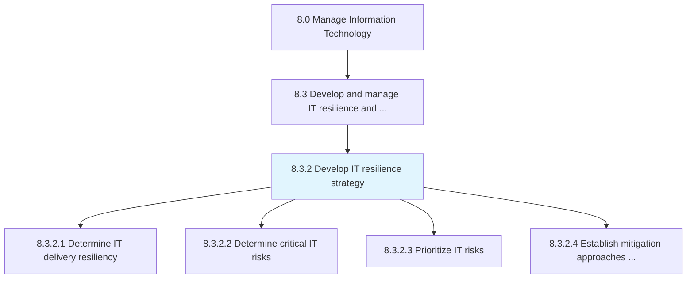
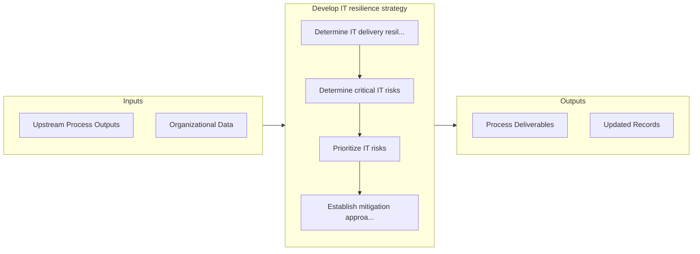

# Develop IT resilience strategy

> Developing resilience strategies of IT across the organization so that prospective risks can be avoided.

## Overview

Process 8.3.2 is a core process that defines the specific procedures for develop it resilience strategy. 

Developing resilience strategies of IT across the organization so that prospective risks can be avoided.

## Process Hierarchy



## Key Statistics

| Metric | Value |
|--------|-------|
| APQC Code | 20716 |
| Hierarchy ID | 8.3.2 |
| Level | Process |
| Parent | [8.3](../) |
| Sub-Processes | 4 |


## GraphDL Semantic Structure

```
develop.ITResilienceStrategy
```

| Component | Value | Description |
|-----------|-------|-------------|
| Verb | `develop` | Primary action |
| Object | `IT resilience strategy` | Direct object |


## Process Flow



## Sub-Processes

| Process | Hierarchy ID | Description |
|---------|-------------|-------------|
| [Determine IT delivery resiliency](./DetermineITDeliveryResiliency) | 8.3.2.1 | Determining resilience strategies to ensure that IT effectively manages it's delivery process to mit |
| [Determine critical IT risks](./DetermineCriticalITRisks) | 8.3.2.2 | Determining risks that could disrupt objectives of IT |
| [Prioritize IT risks](./PrioritizeITRisks) | 8.3.2.3 | Prioritize potential IT risks based on business need to ensure overall IT stability |
| [Establish mitigation approaches for IT risks](./EstablishMitigationApproachesForITRisks) | 8.3.2.4 | Establishing activities to improve opportunities and lessen threats for IT |


## Related Concepts

- ITResilienceStrategy


---

*Source: APQC PCF 20716 (8.3.2) - APQC*
