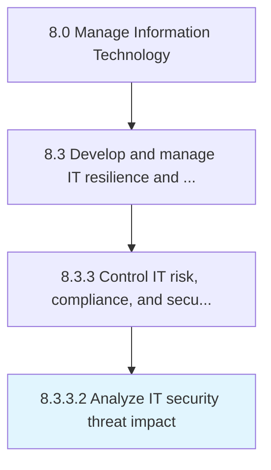

# Analyze IT security threat impact

> Analyzing the impact of threats to critical IT assets across different departments and functions in the organization in terms of quantifiable results.

## Overview

Activity 8.3.3.2 is an activity within the Manage Information Technology framework. 

Analyzing the impact of threats to critical IT assets across different departments and functions in the organization in terms of quantifiable results.

## Process Hierarchy



## Key Statistics

| Metric | Value |
|--------|-------|
| APQC Code | 20723 |
| Hierarchy ID | 8.3.3.2 |
| Level | Activity |
| Parent | [8.3.3](../) |
| Sub-Processes | 0 |


## GraphDL Semantic Structure

```
analyze.ITSecurityThreatImpact
```

| Component | Value | Description |
|-----------|-------|-------------|
| Verb | `analyze` | Primary action |
| Object | `IT security threat impact` | Direct object |


## Related Concepts

- ITSecurityThreatImpact


---

*Source: APQC PCF 20723 (8.3.3.2) - APQC*
