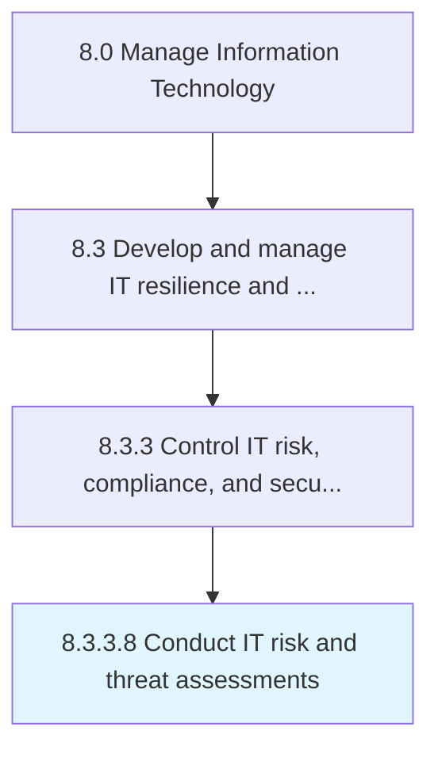

# Conduct IT risk and threat assessments

> Evaluate IT risk and threat assessments by way of IT assets, information security, and breach points within the organization.

## Overview

Activity 8.3.3.8 is an activity within the Manage Information Technology framework. 

Evaluate IT risk and threat assessments by way of IT assets, information security, and breach points within the organization.

## Process Hierarchy



## Key Statistics

| Metric | Value |
|--------|-------|
| APQC Code | 20728 |
| Hierarchy ID | 8.3.3.8 |
| Level | Activity |
| Parent | [8.3.3](../) |
| Sub-Processes | 0 |


## GraphDL Semantic Structure

```
conduct.ITRiskAndThreatAssessments
```

| Component | Value | Description |
|-----------|-------|-------------|
| Verb | `conduct` | Primary action |
| Object | `IT risk and threat assessments` | Direct object |


## Related Concepts

- ITRiskAssessments
- ThreatAssessments


---

*Source: APQC PCF 20728 (8.3.3.8) - APQC*
