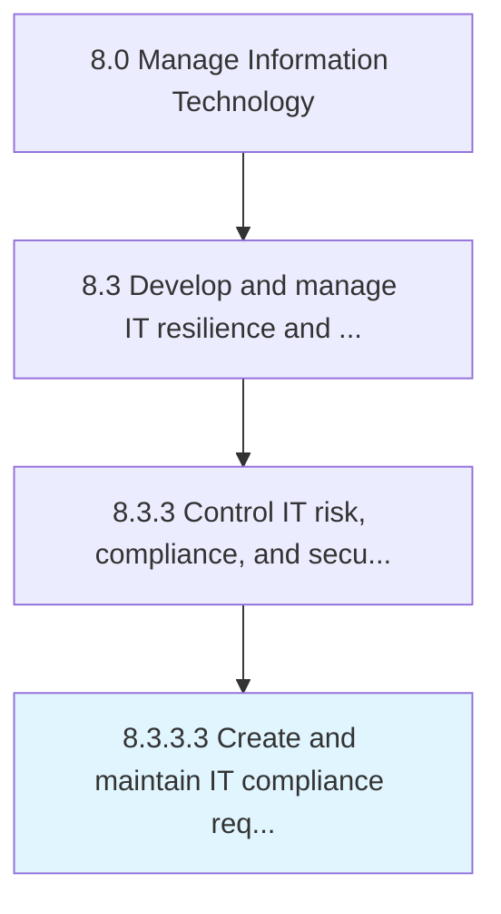

# Create and maintain IT compliance requirements

> Develop and maintain IT compliance standards.

## Overview

Activity 8.3.3.3 is an activity within the Manage Information Technology framework. 

Develop and maintain IT compliance standards. Maintaining requirements set forth by such directives as GRCP, PMI RMP, CGRC, CGEIT, CRMA.

## Process Hierarchy



## Key Statistics

| Metric | Value |
|--------|-------|
| APQC Code | 20724 |
| Hierarchy ID | 8.3.3.3 |
| Level | Activity |
| Parent | [8.3.3](../) |
| Sub-Processes | 0 |


## GraphDL Semantic Structure

```
create.AndMaintainITComplianceRequirements
```

| Component | Value | Description |
|-----------|-------|-------------|
| Verb | `create` | Primary action |
| Object | `and maintain IT compliance requirements` | Direct object |


## Related Concepts

- [ITComplianceRequirements](/concepts/ITComplianceRequirements)
- [ITComplianceRequirements](/concepts/ITComplianceRequirements)


---

*Source: APQC PCF 20724 (8.3.3.3) - APQC*
