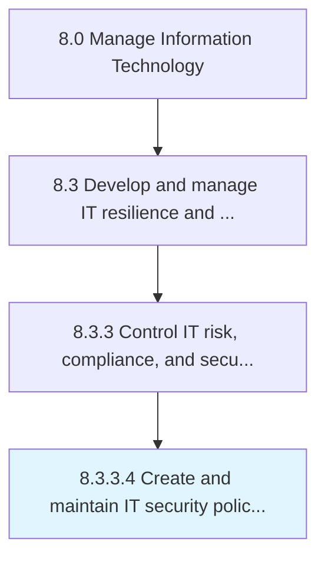

# Create and maintain IT security policies, standards, and procedures

> Develop and maintain an architecture for securing and ensuring the privacy of data flows throughout the organization.

## Overview

Activity 8.3.3.4 is an activity within the Manage Information Technology framework. 

Develop and maintain an architecture for securing and ensuring the privacy of data flows throughout the organization. Create, test, evaluate, and implement IT security policies to ensure the safe use of IT services and solutions.

## Process Hierarchy



## Key Statistics

| Metric | Value |
|--------|-------|
| APQC Code | 20942 |
| Hierarchy ID | 8.3.3.4 |
| Level | Activity |
| Parent | [8.3.3](../) |
| Sub-Processes | 0 |


## GraphDL Semantic Structure

```
create.AndMaintainITSecurityPoliciesStandardsAndProcedures
```

| Component | Value | Description |
|-----------|-------|-------------|
| Verb | `create` | Primary action |
| Object | `and maintain IT security policies, standards, and procedures` | Direct object |


## Related Concepts

- ITSecurityPolicies
- Standards
- Procedures
- ITSecurityPolicies
- Standards
- Procedures


---

*Source: APQC PCF 20942 (8.3.3.4) - APQC*
