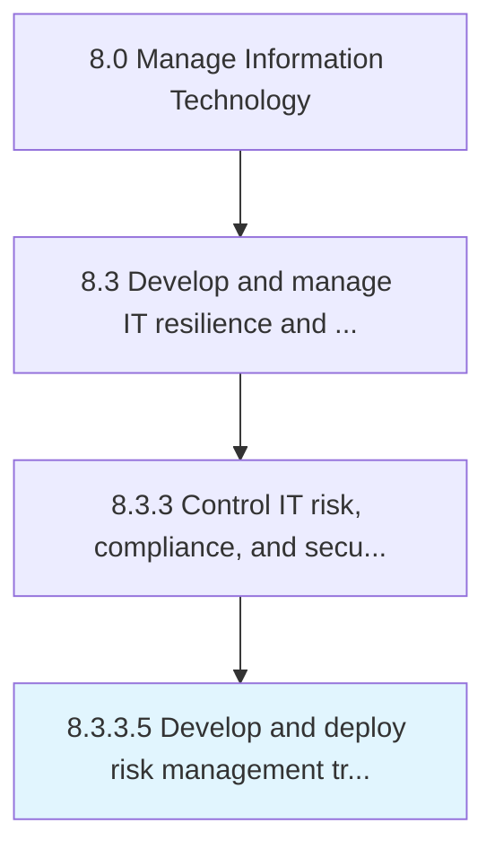

# Develop and deploy risk management training

> Develop and implement training in regard to managing IT risks, understanding criticality, impact, and opportunities associated with business objectives.

## Overview

Activity 8.3.3.5 is an activity within the Manage Information Technology framework. 

Develop and implement training in regard to managing IT risks, understanding criticality, impact, and opportunities associated with business objectives.

## Process Hierarchy



## Key Statistics

| Metric | Value |
|--------|-------|
| APQC Code | 20725 |
| Hierarchy ID | 8.3.3.5 |
| Level | Activity |
| Parent | [8.3.3](../) |
| Sub-Processes | 0 |


## GraphDL Semantic Structure

```
develop.AndDeployRiskManagementTraining
```

| Component | Value | Description |
|-----------|-------|-------------|
| Verb | `develop` | Primary action |
| Object | `and deploy risk management training` | Direct object |


## Related Concepts

- RiskManagementTraining
- RiskManagementTraining


---

*Source: APQC PCF 20725 (8.3.3.5) - APQC*
