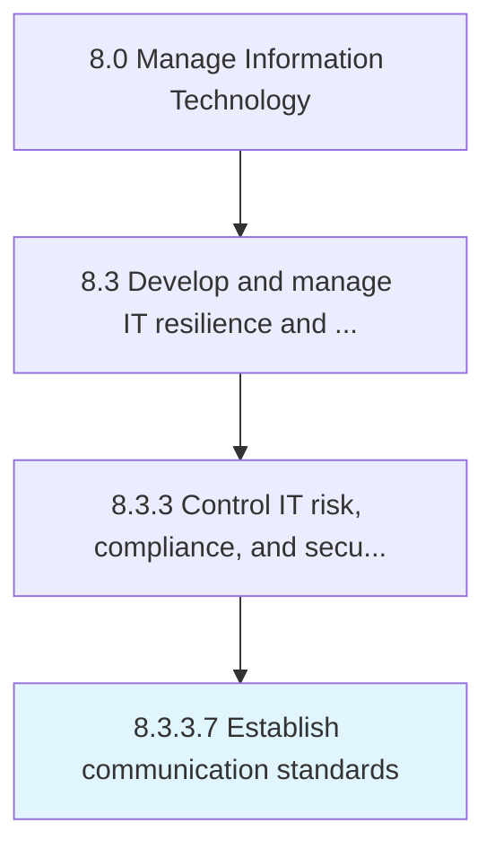

# Establish communication standards

> Establishing standards for communications within the organization which creates the road map for successful understanding of strategic initiatives for both business units and information technology services.

## Overview

Activity 8.3.3.7 is an activity within the Manage Information Technology framework. 

Establishing standards for communications within the organization which creates the road map for successful understanding of strategic initiatives for both business units and information technology services.

## Process Hierarchy



## Key Statistics

| Metric | Value |
|--------|-------|
| APQC Code | 20727 |
| Hierarchy ID | 8.3.3.7 |
| Level | Activity |
| Parent | [8.3.3](../) |
| Sub-Processes | 0 |


## GraphDL Semantic Structure

```
establish.CommunicationStandards
```

| Component | Value | Description |
|-----------|-------|-------------|
| Verb | `establish` | Primary action |
| Object | `communication standards` | Direct object |


## Related Concepts

- CommunicationStandards


---

*Source: APQC PCF 20727 (8.3.3.7) - APQC*
