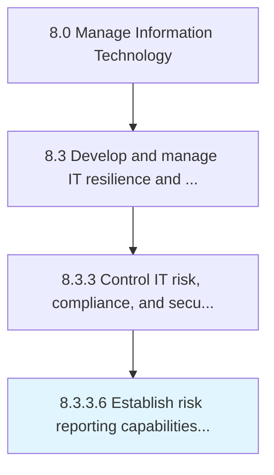

# Establish risk reporting capabilities and responsibilities

> Establishing processes to communicate IT risk to the organization.

## Overview

Activity 8.3.3.6 is an activity within the Manage Information Technology framework. 

Establishing processes to communicate IT risk to the organization.

## Process Hierarchy



## Key Statistics

| Metric | Value |
|--------|-------|
| APQC Code | 20726 |
| Hierarchy ID | 8.3.3.6 |
| Level | Activity |
| Parent | [8.3.3](../) |
| Sub-Processes | 0 |


## GraphDL Semantic Structure

```
establish.RiskReportingCapabilitiesAndResponsibilities
```

| Component | Value | Description |
|-----------|-------|-------------|
| Verb | `establish` | Primary action |
| Object | `risk reporting capabilities and responsibilities` | Direct object |


## Related Concepts

- RiskReportingCapabilities
- Responsibilities


---

*Source: APQC PCF 20726 (8.3.3.6) - APQC*
