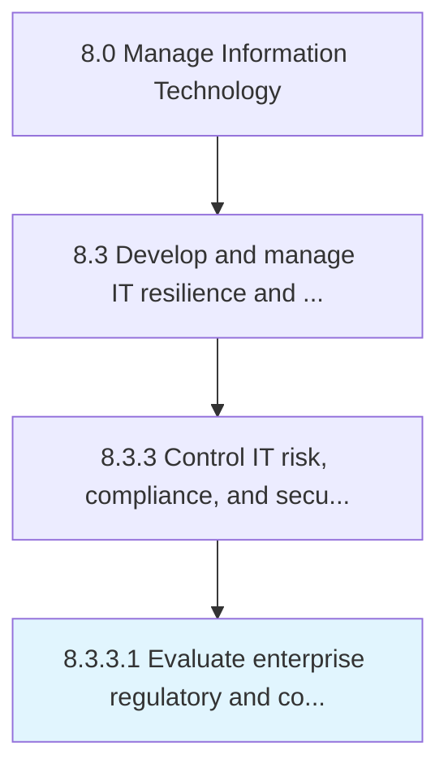

# Evaluate enterprise regulatory and compliance obligations

> Evaluation of dynamic, strategic, and integrated approach to manage regulatory requirements and compliance obligations.

## Overview

Activity 8.3.3.1 is an activity within the Manage Information Technology framework. 

Evaluation of dynamic, strategic, and integrated approach to manage regulatory requirements and compliance obligations.

## Process Hierarchy



## Key Statistics

| Metric | Value |
|--------|-------|
| APQC Code | 20722 |
| Hierarchy ID | 8.3.3.1 |
| Level | Activity |
| Parent | [8.3.3](../) |
| Sub-Processes | 0 |


## GraphDL Semantic Structure

```
evaluate.EnterpriseRegulatoryAndComplianceObligations
```

| Component | Value | Description |
|-----------|-------|-------------|
| Verb | `evaluate` | Primary action |
| Object | `enterprise regulatory and compliance obligations` | Direct object |


## Related Concepts

- [EnterpriseRegulatoryObligations](/concepts/EnterpriseRegulatoryObligations)
- [ComplianceObligations](/concepts/ComplianceObligations)


---

*Source: APQC PCF 20722 (8.3.3.1) - APQC*
