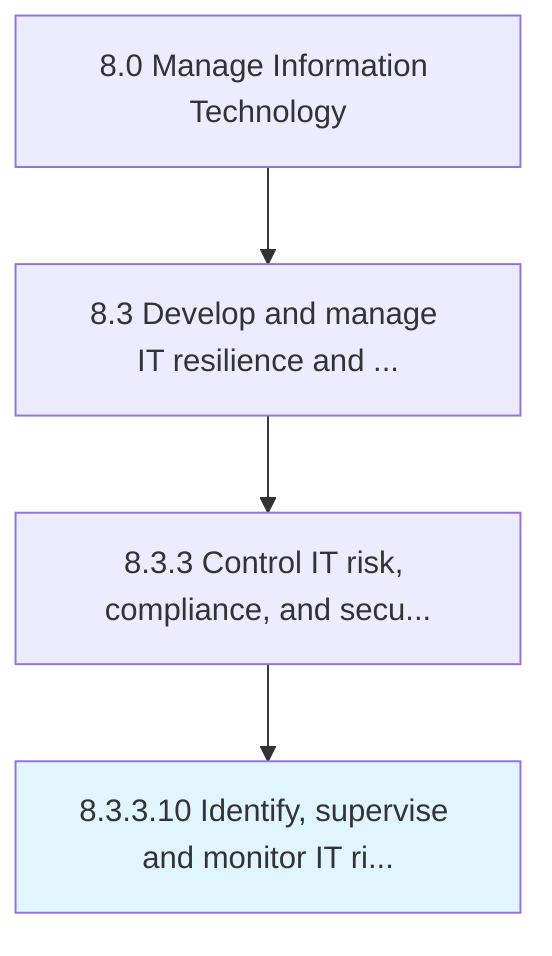

# Identify, supervise and monitor IT risk mitigation measures

> Identifying and supervising a blueprint of measures for managing risk in IT.

## Overview

Activity 8.3.3.10 is an activity within the Manage Information Technology framework. 

Identifying and supervising a blueprint of measures for managing risk in IT. Monitor actions to enhance opportunities and reduce threats to project objectives.

## Process Hierarchy



## Key Statistics

| Metric | Value |
|--------|-------|
| APQC Code | 20730 |
| Hierarchy ID | 8.3.3.10 |
| Level | Activity |
| Parent | [8.3.3](../) |
| Sub-Processes | 0 |


## GraphDL Semantic Structure

```
identify,.SuperviseAndMonitorITRiskMitigationMeasures
```

| Component | Value | Description |
|-----------|-------|-------------|
| Verb | `identify,` | Primary action |
| Object | `supervise and monitor IT risk mitigation measures` | Direct object |


## Related Concepts

- [ITRiskMitigationMeasures](/concepts/ITRiskMitigationMeasures)
- [ITRiskMitigationMeasures](/concepts/ITRiskMitigationMeasures)
- [ITRiskMitigationMeasures](/concepts/ITRiskMitigationMeasures)


---

*Source: APQC PCF 20730 (8.3.3.10) - APQC*
