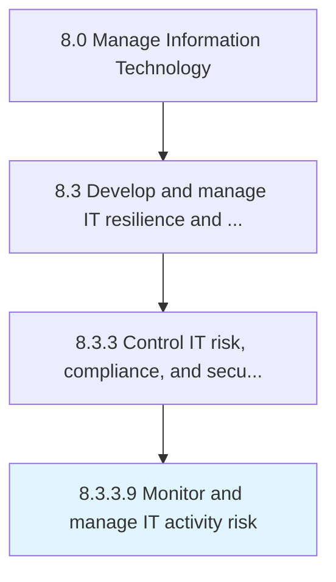

# Monitor and manage IT activity risk

> Monitoring and managing risks related to IT adoption within the organization.

## Overview

Activity 8.3.3.9 is an activity within the Manage Information Technology framework. 

Monitoring and managing risks related to IT adoption within the organization.

## Process Hierarchy



## Key Statistics

| Metric | Value |
|--------|-------|
| APQC Code | 20729 |
| Hierarchy ID | 8.3.3.9 |
| Level | Activity |
| Parent | [8.3.3](../) |
| Sub-Processes | 0 |


## GraphDL Semantic Structure

```
monitor.AndManageITActivityRisk
```

| Component | Value | Description |
|-----------|-------|-------------|
| Verb | `monitor` | Primary action |
| Object | `and manage IT activity risk` | Direct object |


## Related Concepts

- ITActivityRisk
- ITActivityRisk


---

*Source: APQC PCF 20729 (8.3.3.9) - APQC*
