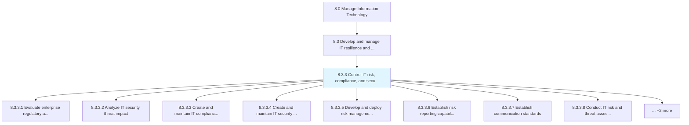
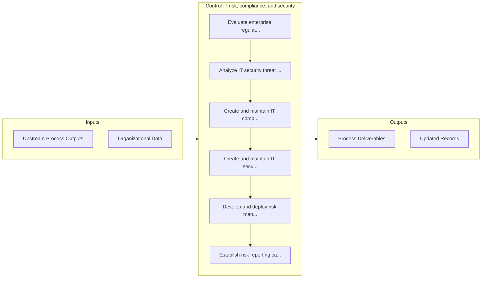

# Control IT risk, compliance, and security

> Ensure effective control in overall IT risk management, formulate and execute guidelines in-line with regulatory bodies, and manage organizational security throughout the business operations.

## Overview

Process 8.3.3 is a core process that defines the specific procedures for control it risk, compliance, and security. 

Ensure effective control in overall IT risk management, formulate and execute guidelines in-line with regulatory bodies, and manage organizational security throughout the business operations.

## Process Hierarchy



## Key Statistics

| Metric | Value |
|--------|-------|
| APQC Code | 20721 |
| Hierarchy ID | 8.3.3 |
| Level | Process |
| Parent | [8.3](../) |
| Sub-Processes | 10 |


## GraphDL Semantic Structure

```graphdl
control.ITRiskComplianceAndSecurity
```

| Component | Value | Description |
|-----------|-------|-------------|
| Verb | `control` | Primary action |
| Object | `IT risk, compliance, and security` | Direct object |


## Process Flow



## Sub-Processes

| Process | Hierarchy ID | Description |
|---------|-------------|-------------|
| [Evaluate enterprise regulatory and compliance obligations](./EvaluateEnterpriseRegulatoryAndComplianceObligations) | 8.3.3.1 | Evaluation of dynamic, strategic, and integrated approach to manage regulatory requirements and comp |
| [Analyze IT security threat impact](./AnalyzeITSecurityThreatImpact) | 8.3.3.2 | Analyzing the impact of threats to critical IT assets across different departments and functions in  |
| [Create and maintain IT compliance requirements](./CreateAndMaintainITComplianceRequirements) | 8.3.3.3 | Develop and maintain IT compliance standards |
| [Create and maintain IT security policies, standards, and procedures](./CreateAndMaintainITSecurityPoliciesStandardsAndProcedures) | 8.3.3.4 | Develop and maintain an architecture for securing and ensuring the privacy of data flows throughout  |
| [Develop and deploy risk management training](./DevelopAndDeployRiskManagementTraining) | 8.3.3.5 | Develop and implement training in regard to managing IT risks, understanding criticality, impact, an |
| [Establish risk reporting capabilities and responsibilities](./EstablishRiskReportingCapabilitiesAndResponsibilities) | 8.3.3.6 | Establishing processes to communicate IT risk to the organization |
| [Establish communication standards](./EstablishCommunicationStandards) | 8.3.3.7 | Establishing standards for communications within the organization which creates the road map for suc |
| [Conduct IT risk and threat assessments](./ConductITRiskAndThreatAssessments) | 8.3.3.8 | Evaluate IT risk and threat assessments by way of IT assets, information security, and breach points |
| [Monitor and manage IT activity risk](./MonitorAndManageITActivityRisk) | 8.3.3.9 | Monitoring and managing risks related to IT adoption within the organization |
| [Identify, supervise and monitor IT risk mitigation measures](./IdentifySuperviseAndMonitorITRiskMitigationMeasures) | 8.3.3.10 | Identifying and supervising a blueprint of measures for managing risk in IT |


## Related Concepts

- ITRisk
- Compliance
- Security


---

*Source: APQC PCF 20721 (8.3.3) - APQC*
