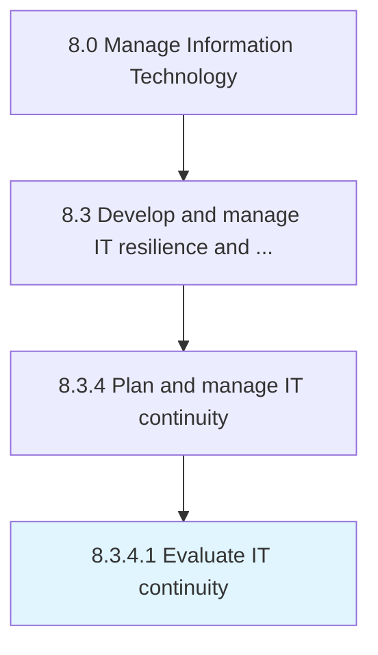

# Evaluate IT continuity

> Evaluating IT business needs and IT's ability to recover from internal or external threat exposure.

## Overview

Activity 8.3.4.1 is an activity within the Manage Information Technology framework. 

Evaluating IT business needs and IT's ability to recover from internal or external threat exposure.

## Process Hierarchy



## Key Statistics

| Metric | Value |
|--------|-------|
| APQC Code | 20732 |
| Hierarchy ID | 8.3.4.1 |
| Level | Activity |
| Parent | [8.3.4](../) |
| Sub-Processes | 0 |


## GraphDL Semantic Structure

```
evaluate.ITContinuity
```

| Component | Value | Description |
|-----------|-------|-------------|
| Verb | `evaluate` | Primary action |
| Object | `IT continuity` | Direct object |


## Related Concepts

- ITContinuity


---

*Source: APQC PCF 20732 (8.3.4.1) - APQC*
