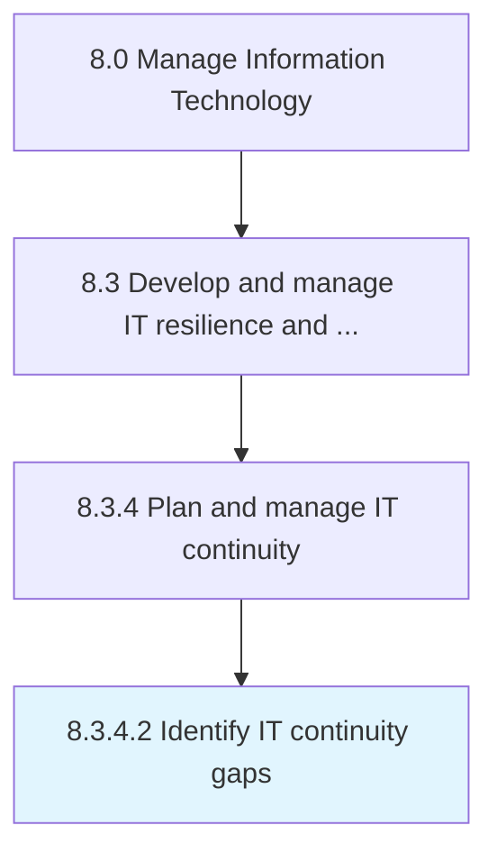

# Identify IT continuity gaps

> Identifying the limitations of the IT organization's ability to remediate disruptions in IT services.

## Overview

Activity 8.3.4.2 is an activity within the Manage Information Technology framework. 

Identifying the limitations of the IT organization's ability to remediate disruptions in IT services.

## Process Hierarchy



## Key Statistics

| Metric | Value |
|--------|-------|
| APQC Code | 20733 |
| Hierarchy ID | 8.3.4.2 |
| Level | Activity |
| Parent | [8.3.4](../) |
| Sub-Processes | 0 |


## GraphDL Semantic Structure

```
identify.ITContinuityGaps
```

| Component | Value | Description |
|-----------|-------|-------------|
| Verb | `identify` | Primary action |
| Object | `IT continuity gaps` | Direct object |


## Related Concepts

- [ITContinuityGaps](/concepts/ITContinuityGaps)


---

*Source: APQC PCF 20733 (8.3.4.2) - APQC*
