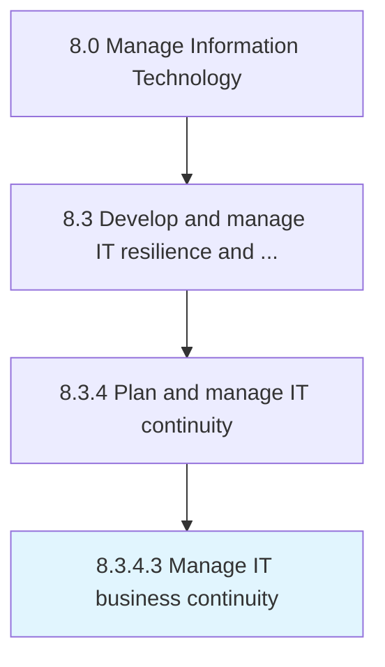

# Manage IT business continuity

> Integrating the disciplines of Emergency Response, Crisis Management, Disaster Recovery (technology continuity) and Business Continuity for IT.

## Overview

Activity 8.3.4.3 is an activity within the Manage Information Technology framework. 

Integrating the disciplines of Emergency Response, Crisis Management, Disaster Recovery (technology continuity) and Business Continuity for IT.

## Process Hierarchy



## Key Statistics

| Metric | Value |
|--------|-------|
| APQC Code | 20734 |
| Hierarchy ID | 8.3.4.3 |
| Level | Activity |
| Parent | [8.3.4](../) |
| Sub-Processes | 0 |


## GraphDL Semantic Structure

```
manage.ITBusinessContinuity
```

| Component | Value | Description |
|-----------|-------|-------------|
| Verb | `manage` | Primary action |
| Object | `IT business continuity` | Direct object |


## Related Concepts

- ITBusinessContinuity


---

*Source: APQC PCF 20734 (8.3.4.3) - APQC*
