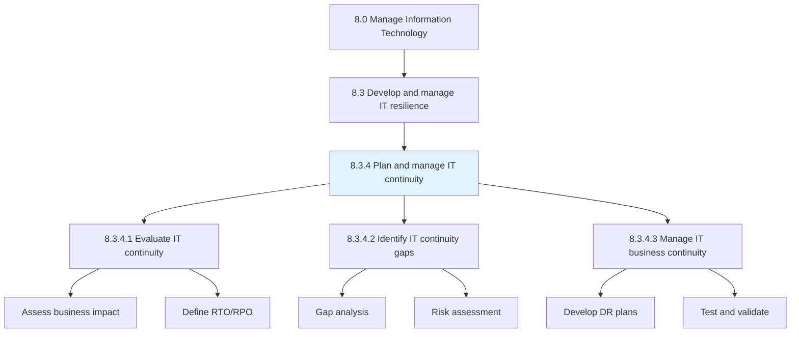
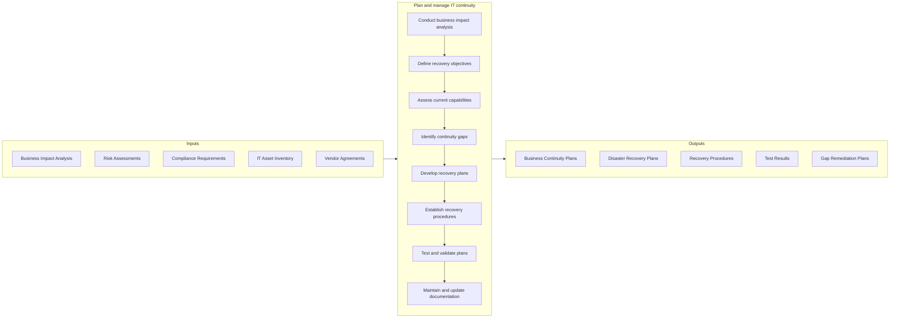
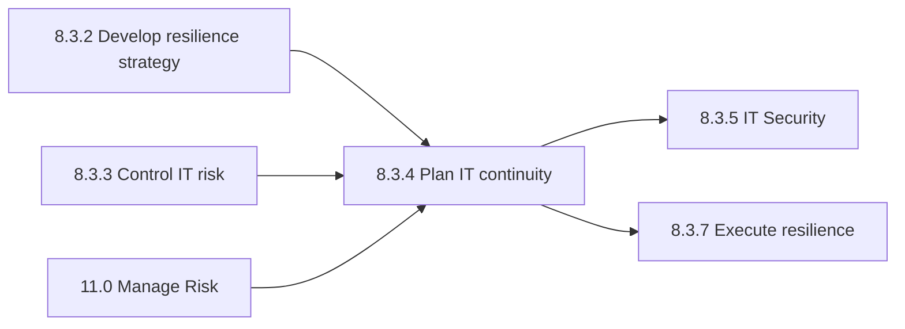

# Plan and manage IT continuity

> Planning and managing IT's ability to recover from exposure to internal and external threats.

## Overview

Process 8.3.4 is a core process that defines the specific procedures for planning and managing IT continuity. This process ensures organizational resilience by establishing comprehensive plans for IT service recovery and business continuity.

Planning and managing IT's ability to recover from exposure to internal and external threats. This encompasses disaster recovery planning, business continuity management, crisis response procedures, and regular testing of recovery capabilities.

IT continuity planning is essential for minimizing business impact during disruptions, whether from natural disasters, cyber attacks, hardware failures, or human error. A robust continuity program ensures that critical business functions can continue with minimal interruption and that full operations can be restored within acceptable timeframes.

## Process Hierarchy



## Key Statistics

| Metric | Value |
|--------|-------|
| APQC Code | 20731 |
| Hierarchy ID | 8.3.4 |
| Level | Process |
| Parent | [8.3](../) |
| Sub-Processes | 3 |
| Industry Variants | 19 |

## GraphDL Semantic Structure

```graphdl
plan.ITContinuity
manage.ITContinuity
ensure.BusinessRecovery
```

| Component | Value | Description |
|-----------|-------|-------------|
| Verb | `plan`, `manage` | Planning and ongoing management actions |
| Object | `IT continuity` | IT disaster recovery and business continuity |

## Process Flow



## Child Process Listings

### 8.3.4.1 - Evaluate IT continuity

Evaluating IT business needs and IT's ability to recover from internal or external threat exposure. This sub-process assesses current recovery capabilities against business requirements.

**Key Activities:**
- Conduct business impact analysis (BIA)
- Define Recovery Time Objectives (RTO)
- Define Recovery Point Objectives (RPO)
- Assess critical system dependencies
- Evaluate current recovery capabilities
- Document business continuity requirements

[View Process Details](./EvaluateITContinuity)

### 8.3.4.2 - Identify IT continuity gaps

Identifying the limitations of the IT organization's ability to remediate disruptions in IT services. This sub-process performs gap analysis to prioritize improvement efforts.

**Key Activities:**
- Compare current state to requirements
- Identify recovery capability gaps
- Assess infrastructure redundancy
- Evaluate backup and replication
- Document gap findings and priorities
- Develop remediation roadmap

[View Process Details](./IdentifyITContinuityGaps)

### 8.3.4.3 - Manage IT business continuity

Integrating the disciplines of Emergency Response, Crisis Management, Disaster Recovery (technology focus), and Business Resumption Planning. This sub-process operationalizes continuity planning.

**Key Activities:**
- Develop disaster recovery plans
- Establish crisis communication procedures
- Define failover and failback procedures
- Conduct tabletop exercises
- Execute full recovery tests
- Maintain plan documentation

[View Process Details](./ManageITBusinessContinuity)

## RACI Matrix

| Activity | IT Continuity Manager | CIO | Risk Manager | Infrastructure Manager | Security Manager | Business Unit Heads |
|----------|----------------------|-----|--------------|----------------------|------------------|---------------------|
| Conduct BIA | R | I | C | C | C | A |
| Define RTO/RPO | R | A | C | C | C | R |
| Assess current capabilities | R | I | C | R | C | I |
| Identify continuity gaps | R | C | A | C | C | I |
| Develop recovery plans | R | A | C | R | C | C |
| Establish procedures | R | I | C | R | C | I |
| Test and validate plans | R | A | C | R | C | C |
| Maintain documentation | R | I | C | C | C | I |

**Legend:** R = Responsible, A = Accountable, C = Consulted, I = Informed

## Metrics and KPIs

| Metric | Description | Target | Frequency |
|--------|-------------|--------|-----------|
| RTO Achievement | Percentage of systems meeting RTO targets | 100% | Per test |
| RPO Achievement | Percentage of systems meeting RPO targets | 100% | Per test |
| Plan Coverage | Percentage of critical systems with DR plans | 100% | Quarterly |
| Test Completion Rate | Percentage of scheduled tests completed | 100% | Annual |
| Test Success Rate | Percentage of tests meeting objectives | >95% | Per test |
| Time Since Last Test | Days since last DR test by system | <365 days | Monthly |
| Plan Currency | Percentage of plans updated within 12 months | 100% | Quarterly |
| Gap Remediation Rate | Percentage of identified gaps addressed | >80% | Quarterly |
| Recovery Declaration Time | Time to declare and initiate recovery | <30 min | Per incident |
| Mean Time to Recovery | Average time to restore critical services | <RTO | Per incident |

## Related Departments

- [IT Risk Management](/departments/IT/Risk) - Risk assessment and management
- [IT Infrastructure](/departments/IT/Infrastructure) - Recovery infrastructure
- [Information Security](/departments/IT/Security) - Security continuity
- [Enterprise Risk Management](/departments/Risk) - Enterprise continuity alignment
- [Facilities Management](/departments/Facilities) - Physical infrastructure
- [Business Operations](/departments/Operations) - Business process recovery

## Related Occupations

- [Information Security Analysts](/occupations/Technology/Security/InformationSecurityAnalysts) - Security continuity
- [Computer and Information Systems Managers](/occupations/Technology/Management/ComputerInformationSystemsManagers) - IT continuity oversight
- [Network and Computer Systems Administrators](/occupations/Technology/Infrastructure/NetworkAdministrators) - Infrastructure recovery
- [Database Administrators](/occupations/Technology/Database/DatabaseAdministrators) - Data recovery
- [Emergency Management Directors](/occupations/Management/EmergencyManagementDirectors) - Crisis coordination
- [Management Analysts](/occupations/Business/Operations/ManagementAnalysts) - BIA and planning

## Related Concepts

- ITContinuity
- DisasterRecovery
- BusinessContinuity
- RecoveryTimeObjective
- RecoveryPointObjective
- CrisisManagement

## Related Processes



---

*Source: APQC PCF 20731 (8.3.4) - APQC*
