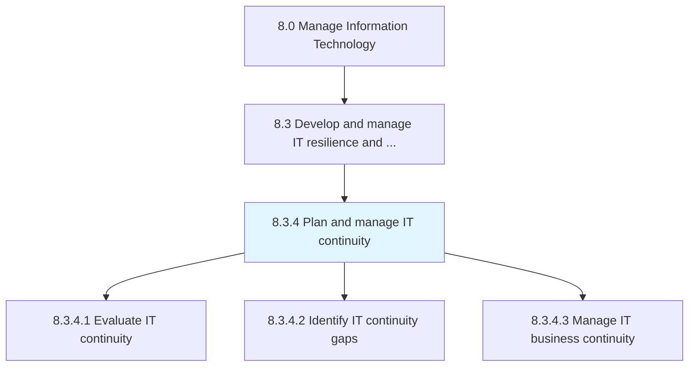
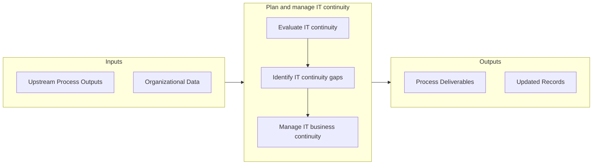

# Plan and manage IT continuity

> Planning and managing IT's ability to recover from exposure to internal and external threats.

## Overview

Process 8.3.4 is a core process that defines the specific procedures for plan and manage it continuity. 

Planning and managing IT's ability to recover from exposure to internal and external threats.

## Process Hierarchy



## Key Statistics

| Metric | Value |
|--------|-------|
| APQC Code | 20731 |
| Hierarchy ID | 8.3.4 |
| Level | Process |
| Parent | [8.3](../) |
| Sub-Processes | 3 |


## GraphDL Semantic Structure

```
plan.AndManageITContinuity
```

| Component | Value | Description |
|-----------|-------|-------------|
| Verb | `plan` | Primary action |
| Object | `and manage IT continuity` | Direct object |


## Process Flow



## Sub-Processes

| Process | Hierarchy ID | Description |
|---------|-------------|-------------|
| [Evaluate IT continuity](./EvaluateITContinuity) | 8.3.4.1 | Evaluating IT business needs and IT's ability to recover from internal or external threat exposure |
| [Identify IT continuity gaps](./IdentifyITContinuityGaps) | 8.3.4.2 | Identifying the limitations of the IT organization's ability to remediate disruptions in IT services |
| [Manage IT business continuity](./ManageITBusinessContinuity) | 8.3.4.3 | Integrating the disciplines of Emergency Response, Crisis Management, Disaster Recovery (technology  |


## Related Concepts

- ITContinuity
- ITContinuity


---

*Source: APQC PCF 20731 (8.3.4) - APQC*
