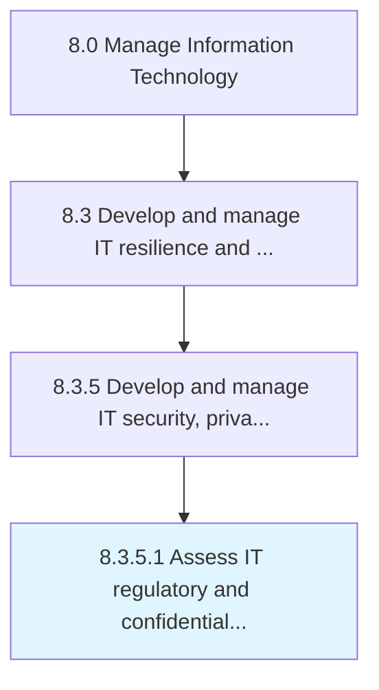

# Assess IT regulatory and confidentiality requirements and policies

> Evaluate principles or rules employed in controlling, directing, or managing IT services.

## Overview

Activity 8.3.5.1 is an activity within the Manage Information Technology framework. 

Evaluate principles or rules employed in controlling, directing, or managing IT services. Assessing requirements and policies related to confidentiality.

## Process Hierarchy



## Key Statistics

| Metric | Value |
|--------|-------|
| APQC Code | 20736 |
| Hierarchy ID | 8.3.5.1 |
| Level | Activity |
| Parent | [8.3.5](../) |
| Sub-Processes | 0 |


## GraphDL Semantic Structure

```
assess.ITRegulatoryAndConfidentialityRequirementsAndPolicies
```

| Component | Value | Description |
|-----------|-------|-------------|
| Verb | `assess` | Primary action |
| Object | `IT regulatory and confidentiality requirements and policies` | Direct object |


## Related Concepts

- [ITRegulatoryRequirements](/concepts/ITRegulatoryRequirements)
- [Policies](/concepts/Policies)
- [ConfidentialityRequirements](/concepts/ConfidentialityRequirements)
- [Policies](/concepts/Policies)


---

*Source: APQC PCF 20736 (8.3.5.1) - APQC*
