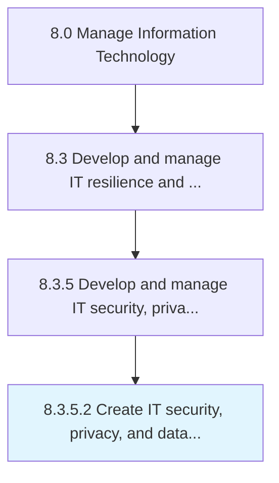

# Create IT security, privacy, and data protection risk governance

> Defining and managing organization's approach to governing IT security and ensuring the privacy of data flows throughout the organization.

## Overview

Activity 8.3.5.2 is an activity within the Manage Information Technology framework. 

Defining and managing organization's approach to governing IT security and ensuring the privacy of data flows throughout the organization. Establish and manage tools to support the governance process in order to avoid misuse of information and breach of organizational privacy.

## Process Hierarchy



## Key Statistics

| Metric | Value |
|--------|-------|
| APQC Code | 20737 |
| Hierarchy ID | 8.3.5.2 |
| Level | Activity |
| Parent | [8.3.5](../) |
| Sub-Processes | 0 |


## GraphDL Semantic Structure

```
create.ITSecurityPrivacyAndDataProtectionRiskGovernance
```

| Component | Value | Description |
|-----------|-------|-------------|
| Verb | `create` | Primary action |
| Object | `IT security, privacy, and data protection risk governance` | Direct object |


## Related Concepts

- ITSecurity
- Privacy
- DataProtectionRiskGovernance


---

*Source: APQC PCF 20737 (8.3.5.2) - APQC*
