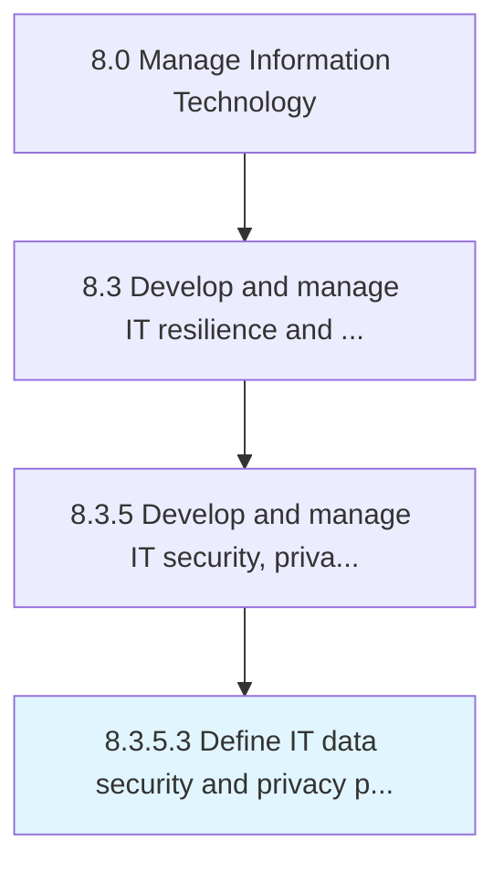

# Define IT data security and privacy policies, standards, and procedures

> Outlining and establishing policies, regulations, standards, and procedures for IT data security and privacy.

## Overview

Activity 8.3.5.3 is an activity within the Manage Information Technology framework. 

Outlining and establishing policies, regulations, standards, and procedures for IT data security and privacy.

## Process Hierarchy



## Key Statistics

| Metric | Value |
|--------|-------|
| APQC Code | 20738 |
| Hierarchy ID | 8.3.5.3 |
| Level | Activity |
| Parent | [8.3.5](../) |
| Sub-Processes | 0 |


## GraphDL Semantic Structure

```
define.ITDataSecurityAndPrivacyPoliciesStandardsAndProcedures
```

| Component | Value | Description |
|-----------|-------|-------------|
| Verb | `define` | Primary action |
| Object | `IT data security and privacy policies, standards, and procedures` | Direct object |


## Related Concepts

- [ITDataSecurityPolicies](/concepts/ITDataSecurityPolicies)
- [PrivacyPolicies](/concepts/PrivacyPolicies)
- [Standards](/concepts/Standards)
- [Procedures](/concepts/Procedures)


---

*Source: APQC PCF 20738 (8.3.5.3) - APQC*
